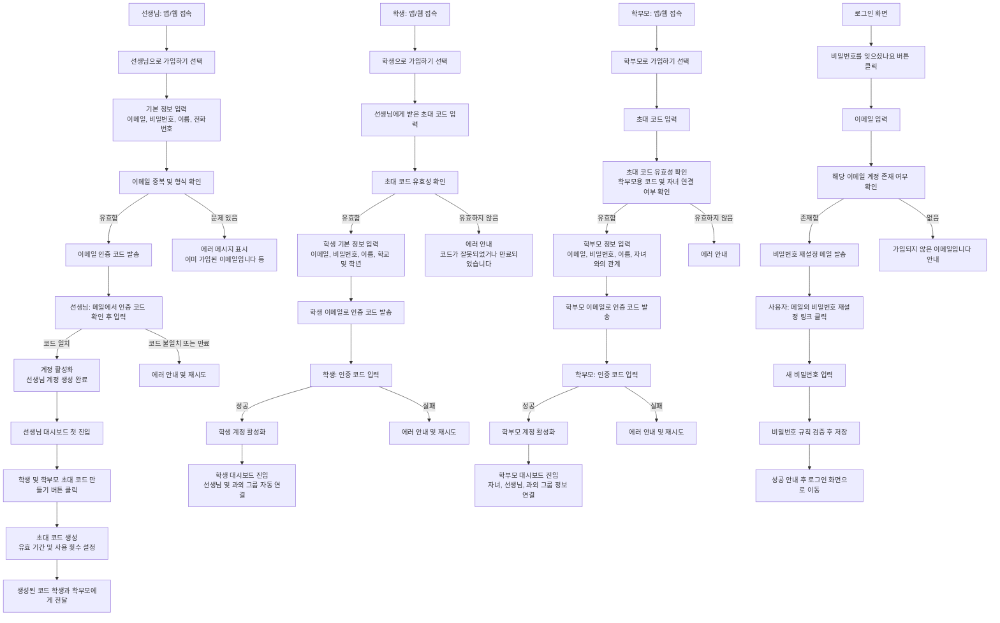

# [기획서] WeTee 회원가입 및 로그인 (이해하기 쉬운 버전)

## 1. 이 기능을 왜 만드나요? (배경 및 목적)

WeTee는 **개인 과외를 더 체계적으로, 덜 번거롭게 관리하기 위한 서비스**입니다.
그중에서도 회원가입과 로그인(F-001)은 모든 기능의 출발점이 되는 **입구**이자, **관계 구조(누가 누구와 연결되어 있는지)를 처음 정의하는 단계**입니다.

이 기능을 통해 다음을 달성하려고 합니다.

1. **선생님**은 스스로 계정을 만들고, 자신의 과외 학생과 학부모를 초대할 수 있습니다.
2. **학생과 학부모**는 항상 **“어느 선생님 아래에 속한지”가 명확한 상태로만** 가입할 수 있습니다.

   * 아무나 들어와서 둘러보는 서비스가 아니라, **선생님이 초대한 사람만 들어오는 "초대 기반 공간"**입니다.
3. 한 번 연결된 관계(선생님–학생–학부모)는 이후 기능들(일정, 출결, 진도, 정산 등)의 **기준 축**이 됩니다.

   * 예: “어느 학생이 어느 선생님 수업에 몇 번 출석했는지”를 정확히 계산할 수 있음

정리하면, **F-001의 목표는 “안전하게 사람을 들이고, 누가 누구와 연결되어 있는지 깔끔하게 정리하는 것”**입니다.

## 2. 사용자 스토리 (User Stories)

"누가, 어떤 상황에서, 무엇을 하고 싶고, 그래서 어떤 이득이 있는지"를 한눈에 볼 수 있도록 정리한 표입니다.

| ID     | 누구 (Who)          | 어떤 상황 (When/Context)              | 무엇을 하고 싶다 (Need)                             | 그래야 어떤 이득 (Benefit)                               |
| ------ | ----------------- | --------------------------------- | -------------------------------------------- | ------------------------------------------------- |
| T-01   | 선생님               | 새로 과외를 시작해서 WeTee를 처음 알게 되었을 때    | 간단한 정보만 넣고 **내 계정을 만들고 싶다**                  | 내 이름으로 된 공간을 만들고, 학생·학부모를 초대할 수 있다                |
| T-02   | 선생님               | 이미 가르치는 학생에게 WeTee를 써보자고 제안했을 때   | **학생·학부모에게 보낼 초대 코드를 만들고 싶다**                | 초대 받은 사람만 들어올 수 있어서, 내 과외 공간이 깔끔하게 유지된다           |
| T-03   | 선생님               | 수업 준비와 관리에 집중하고 싶을 때              | 로그인만 하면 **연결된 학생·학부모가 정리된 대시보드**로 바로 들어가고 싶다 | 일정, 출결, 정산을 따로따로 관리하지 않고 한 번에 볼 수 있다              |
| S-01   | 학생                | 선생님이 “앱 깔고, 이 코드를 넣어서 가입해”라고 했을 때 | **초대 코드를 입력해서 내 계정을 만들고 싶다**                 | 내가 가입만 하면, 자동으로 선생님과 수업이 연결되어 일정/과제를 한 곳에서 볼 수 있다 |
| S-02   | 학생                | 핸드폰을 바꾸거나, 비밀번호를 잊어버렸을 때          | **이메일을 통해 비밀번호를 다시 만들고 싶다**                  | 선생님께 다시 연락하지 않고도, 스스로 계정에 다시 들어갈 수 있다             |
| P-01   | 학부모               | 자녀 과외 상황을 투명하게 관리하고 싶을 때          | 선생님이 준 **초대 코드를 넣고 학부모 계정을 만들고 싶다**          | 자녀 수업 일정·출결·수업료를 한 곳에서 확인할 수 있다                   |
| P-02   | 학부모               | 남편/아내도 자녀 과외 정보를 같이 보길 원할 때       | **같은 초대 코드로 두 명 이상이 가입할 수 있으면 좋겠다**          | 한 집에서 두 명 이상이 같은 정보를 공유해, 커뮤니케이션이 편해진다            |
| A-01   | 모든 사용자            | 이미 가입한 상태에서 다시 접속할 때              | **이메일과 비밀번호로 바로 로그인하고 싶다**                   | 각자 역할(선생님/학생/학부모)에 맞는 첫 화면으로 빠르게 진입한다             |
| A-02   | 모든 사용자            | 비밀번호를 잊어버렸을 때                     | **내 이메일로 비밀번호 재설정 링크를 받아 새 비밀번호를 만들고 싶다**    | 고객센터에 연락하지 않고도, 스스로 계정을 복구할 수 있다                  |
| SEC-01 | 서비스 운영자(간접 이해관계자) | 서비스가 성장해 사용자 수가 많아질 때             | **이상한 로그인 시도나 무차별 대입 공격을 막고 싶다**             | 계정 도용을 줄이고, 서비스 신뢰도를 유지할 수 있다                     |

이 표를 기준으로, 디자인/개발/마케팅 모두가 “각 사용자 입장에서 이 기능이 어떤 가치를 주는지”를 동일하게 공유할 수 있습니다.

## 3. 서비스 흐름도 (Process Flow)

### 3.1 전체 큰 그림

가장 중요한 흐름은 **선생님이 먼저 들어오고 → 초대 코드를 만들고 → 학생/학부모가 그 코드로 들어오는 구조**입니다.

이 흐름도를 기준으로, 디자이너는 화면 전환·버튼 위치를, 개발자는 실제 API·상태 전이를 설계하고, 마케터/클라이언트는 서비스의 **진입 구조와 보안 레벨**을 쉽게 이해할 수 있습니다.

## 4. 주요 정책 FAQ

딱딱한 제약 사항 대신, 실제로 나올 법한 질문에 답하는 형식으로 정리했습니다.

### 4.1 가입/초대 관련

**Q. 학생이 앱을 혼자 깔아서, 선생님 없이 바로 가입할 수 있나요?**
A. **아니요.** 학생과 학부모는 반드시 **선생님이 발급한 초대 코드가 있어야만 가입**할 수 있습니다.
→ 이유: 누구나 들어오는 오픈 커뮤니티가 아니라, **선생님 중심의 닫힌 과외 공간**을 만들기 위해서입니다.

**Q. 선생님은 초대 코드 없이도 가입할 수 있나요?**
A. **네.** 선생님은 초대 코드 없이, 일반 서비스처럼 **스스로 계정을 만들 수 있습니다.**
이후 자신의 대시보드에서 학생·학부모용 초대 코드를 생성합니다.

**Q. 같은 이메일로 선생님/학생/학부모 계정을 여러 개 만들 수 있나요?**
A. 기본적으로 **같은 역할(Role)로는 한 번만 가입**할 수 있습니다.
예: `teacher@example.com`으로 선생님 계정은 1개만 가능.
(향후 필요에 따라, "선생님 + 학부모"처럼 역할이 다른 2개 계정을 같은 이메일로 허용할지는 별도 정책으로 검토할 수 있습니다.)

**Q. 초대 코드 유효 기간은 얼마나 되나요?**
A. 기본값은 **7일**로 설정하며, 서비스 정책에 따라 바꿀 수 있습니다.
카페에서 바로 가입시키는 상황, 주말에 보내두고 평일에 가입하는 상황 등을 고려해 운영팀과 함께 조정할 수 있습니다.

**Q. 초대 코드는 몇 번까지 쓸 수 있나요?**
A. 기본적으로 **학생용 초대 코드는 1회 사용 후 자동 만료**됩니다.
학부모용 초대 코드는 **자녀를 함께 보는 보호자가 2명 이상일 수 있으므로, 제한적 다회 사용(예: 2회)**을 허용할 수 있습니다.

**Q. 초대 코드가 만료되면, 이미 가입해 둔 학생/학부모와의 연결도 끊기나요?**
A. **아니요.** 초대 코드는 "입장 티켓" 역할만 합니다.
이미 가입이 완료된 학생·학부모와의 연결은 코드 만료와 상관없이 유지됩니다.

### 4.2 비밀번호/보안 관련

**Q. 비밀번호 규칙은 얼마나 엄격한가요?**
A. 서비스 초기에는 다음 수준을 기본으로 합니다.

* 최소 8자 이상, 최대 64자 이하
* 영문 대/소문자, 숫자, 특수문자 중 **2가지 이상 조합**
* 이메일 주소와 거의 동일한 비밀번호는 불가 (예: `test@test.com` → `testtest` 금지)

이 정도면 일반적인 서비스와 유사한 수준의 보안/편의 밸런스를 맞출 수 있습니다.

**Q. 비밀번호를 잊었을 때는 어떻게 하나요?**
A. 로그인 화면에서 **"비밀번호를 잊으셨나요?"** 버튼을 누르면,
가입 시 등록한 이메일로 비밀번호 재설정 링크가 발송됩니다.
사용자는 새 비밀번호를 설정하고, 바로 다시 로그인할 수 있습니다.

**Q. 누군가 내 계정 비밀번호를 계속 틀리게 입력하면 어떻게 되나요?**
A. 같은 계정으로 **연속 5회 이상 로그인에 실패하면**, 계정이 잠시 **잠금 상태**로 전환됩니다.
일정 시간이 지나면 자동으로 풀리거나, 비밀번호 재설정을 통해 바로 해제할 수 있습니다.
→ 무차별 대입 공격(Brute force)을 방지하기 위한 최소한의 안전장치입니다.

### 4.3 로그인/계정 상태 관련

**Q. 이메일 인증을 하지 않아도 로그인할 수 있나요?**
A. **아니요.** 가입 직후에는 계정 상태가 "이메일 미인증" 상태입니다.
이메일 인증을 완료해야만, 정상 계정으로 로그인하여 서비스를 사용할 수 있습니다.

**Q. 탈퇴한 계정은 완전히 삭제되나요?**
A. 사용자 입장에서는 로그인·접속이 불가능해지지만,
법적·정산 이력 등을 위해 **일정 기간 동안 최소한의 기록은 보관**할 수 있습니다.
(자세한 보존 기간은 개인정보 처리방침 및 정산 정책에 맞춰 별도 정의)

## 5. 화면 구성안 (UI Wireframe Description)

텍스트로 표현한 와이어프레임 수준의 설명입니다. 실제 디자인은 이 구조를 기반으로 Figma 등에서 시각화합니다.

### 5.1 공통 톤 & 가이드

* 전체 톤: **차분하고 신뢰감 있는 교육 서비스 느낌** (불필요하게 화려하지 않음)
* 한글 기준 쉬운 문장 사용: "~해 주세요" 수준의 정중하지만 부담 없는 문장
* 주요 버튼 색: 서비스 브랜드 메인 컬러(파란 계열) 사용
* 오류 메시지: 빨간색 계열의 짧고 명확한 문장 (예: "이메일 형식이 올바르지 않습니다")

### 5.2 화면 1 – 역할 선택 및 온보딩 (S-001)

**목적**

* 처음 들어온 사용자가 **"나는 어떤 사람으로 이 서비스를 쓰게 될까?"**를 한 번에 이해하고, 적절한 가입 경로를 선택하게 하는 화면입니다.

**구성 (위에서 아래 순서)**

1. 상단

   * 서비스 로고
   * 간단한 한 줄 메시지:
     `"과외 준비부터 정산까지, 한 번에 관리해 보세요."`

2. 중단 – 역할 선택 카드 3개

   * 카드 1: **선생님으로 사용하기**

     * 아이콘: 칠판/책/펜 등 교사 느낌
     * 짧은 설명:
       `"과외 일정, 출결, 정산을 한 곳에서 관리하고 싶을 때"`
     * 하단 버튼: `선생님으로 시작하기`
   * 카드 2: **학생으로 사용하기**

     * 설명:
       `"선생님이 보내준 초대 코드로 수업 일정과 진도를 확인해요"`
     * 버튼: `학생으로 시작하기`
   * 카드 3: **학부모로 사용하기**

     * 설명:
       `"자녀의 수업 일정과 정산 내역을 투명하게 확인해요"`
     * 버튼: `학부모로 시작하기`

3. 하단

   * 텍스트 링크:
     `이미 계정이 있으신가요?` → `로그인하기`

### 5.3 화면 2 – 선생님 회원가입 폼 (S-002)

**목적**

* 선생님이 **최소한의 정보**로 빠르게 계정을 만들고, 즉시 대시보드로 진입할 수 있게 합니다.

**구성**

1. 상단 타이틀

   * `선생님으로 가입하기`
   * 부제: `"학생과 학부모를 초대해, 과외를 체계적으로 관리해 보세요."`

2. 입력 폼

   * `이메일` (텍스트 입력)

     * 플레이스홀더: `example@school.com`
   * `비밀번호`
   * `비밀번호 확인`
   * `이름`
   * `전화번호` (선택)
   * 비밀번호 규칙 안내 (작은 글씨):
     `비밀번호는 8자 이상, 영문/숫자/특수문자 중 2가지 이상을 포함해 주세요.`

3. 하단 버튼

   * 주요 버튼: `가입하고 계속하기`
   * 부가 문구: `가입 버튼을 누르면 이용약관 및 개인정보 처리방침에 동의한 것으로 간주됩니다.` (약관/정책 링크 포함)

4. 에러/검증 메시지 예시

   * 이메일 중복: `이미 가입된 이메일입니다. 로그인으로 이동해 주세요.`
   * 비밀번호 불일치: `비밀번호와 비밀번호 확인이 일치하지 않습니다.`

5. 가입 성공 후

   * 잠깐의 안내 화면 또는 토스트:
     `"이메일로 인증 코드를 보냈어요. 받은 메일의 코드를 입력해 인증을 완료해 주세요."`
   * 이어서 **이메일 인증 화면(S-005)**로 이동

### 5.4 화면 3 – 초대 코드 입력 화면 (S-003)

**목적**

* 학생/학부모가 **선생님이 준 코드만 입력하면**, 자연스럽게 올바른 선생님·그룹에 연결되도록 합니다.

**구성**

1. 상단 타이틀

   * `초대 코드 입력`
   * 부제는 역할에 따라 다르게 표기:

     * 학생: `선생님이 보내주신 코드를 입력해 주세요.`
     * 학부모: `자녀를 맡고 있는 선생님에게 받은 코드를 입력해 주세요.`

2. 코드 입력 영역

   * 6자리 코드 입력 필드 (한 칸씩 쪼개진 형태 또는 한 줄 입력)
   * 아래 안내 문구:
     `"코드를 모르신다면, 담당 선생님께 다시 문의해 주세요."`

3. 버튼

   * 주요 버튼: `다음으로`

4. 에러 케이스

   * 잘못된 코드: `코드가 올바르지 않습니다. 다시 확인해 주세요.`
   * 만료된 코드: `코드 사용 기간이 지났습니다. 선생님께 새 코드를 요청해 주세요.`

### 5.5 화면 4 – 로그인 화면 (S-004)

**목적**

* 이미 가입한 사용자가 **최소한의 단계로 자신의 역할에 맞는 첫 화면으로 들어오게** 합니다.

**구성**

1. 타이틀

   * `로그인`

2. 입력 필드

   * `이메일`
   * `비밀번호`

3. 보조 요소

   * 체크박스: `이 기기에서 로그인 상태 유지`
   * 링크: `비밀번호를 잊으셨나요?`

4. 버튼

   * 주요 버튼: `로그인`
   * 하단 텍스트:
     `처음 이용하시나요?` → `역할 선택하고 가입하기`

5. 에러 메시지 예시

   * `이메일 또는 비밀번호가 올바르지 않습니다.`
   * `로그인 시도 횟수가 초과되어 계정이 잠시 잠겼습니다. 몇 분 후 다시 시도해 주세요.`

### 5.6 화면 5 – 비밀번호 재설정 플로우 (S-008, S-009)

**단계 1: 이메일 입력 화면 (S-008)**

* 타이틀: `비밀번호 재설정`
* 설명: `가입하실 때 사용한 이메일 주소를 입력해 주세요. 비밀번호를 바꿀 수 있는 링크를 보내 드립니다.`
* 필드: `이메일`
* 버튼: `이메일 보내기`
* 에러: `가입되지 않은 이메일입니다.`
* 성공 안내: `비밀번호 재설정 링크를 이메일로 보냈어요. 메일함을 확인해 주세요.`

**단계 2: 새 비밀번호 설정 화면 (S-009)**

* 타이틀: `새 비밀번호 설정`
* 필드: `새 비밀번호`, `새 비밀번호 확인`
* 안내: 비밀번호 규칙 문구 재사용
* 버튼: `비밀번호 변경하기`
* 성공 안내: `비밀번호가 변경되었습니다. 새 비밀번호로 로그인해 주세요.` → 로그인 화면 이동

## [여기서부터 원본 데이터]

# F-001 회원가입 및 로그인 – 기능 명세서 리마스터 초안

## A. 코어 스펙

### 1. 기능 개요

WeTee의 회원가입 및 로그인 기능(F-001)은 서비스 내 모든 기능의 출발점이 되는 **계정·역할·관계 관리의 기반 기능**이다.

이 기능의 주요 목적은 다음과 같다.

* 선생님, 학생, 학부모가 각자의 역할에 맞는 계정을 안전하게 생성하고 인증할 수 있도록 한다.
* 학생과 학부모는 반드시 **기존 선생님과 연결된 상태(초대 코드 기반)**로만 가입되도록 강제하여, 과외 관계가 항상 명확한 소속 구조를 갖도록 한다.
* 이후 기능(F-002 과외 그룹, F-003 일정, F-004 출결, F-005 진도, F-006 정산 등)이 공통으로 사용하는 **식별 가능한 사용자 정보(역할, 소속, 상태)**를 일관되게 제공한다.

F-001의 범위는 다음을 포함한다.

* 선생님/학생/학부모 신규 가입
* 이메일 기반 계정 인증
* 이메일+비밀번호 로그인
* 비밀번호 재설정(비밀번호 분실 시)
* 초대 코드 생성/사용을 통한 사용자–선생님–그룹 연결 로직의 기초 정의

반대로 아래 항목들은 F-001의 범위를 벗어나며,
추후 **인증·보안 기능군(F-01X 시리즈, 예: F-010 소셜 로그인, F-011 세션/토큰 관리, F-012 2단계 인증)** 기능 명세서에서 상세 정의한다.

* 소셜 로그인(카카오/네이버/구글 등)
* 다중 기기 로그인 관리, 세션 만료 정책의 세부 설정
* 2단계 인증(2FA), 관리자/운영자 계정 정책

### 2. 용어 정의

아래 용어들은 F-001 기능 명세 전반에서 공통으로 사용하는 개념이다.

* **User(사용자)**: WeTee에 가입한 모든 계정의 상위 개념. 하나의 User는 정확히 하나의 Role을 가진다.
* **Role(역할)**: 사용자의 유형을 나타내는 속성. 현재는 `TEACHER`(선생님), `STUDENT`(학생), `PARENT`(학부모) 세 가지 값을 가진다.
* **선생님(Teacher)**: 과외를 제공하는 주체. 과외 그룹을 생성하고, 학생/학부모를 초대하며, 일정·출결·진도·정산의 기준이 되는 사용자.
* **학생(Student)**: 선생님에게 과외를 받는 학습자. 초대 코드로만 가입할 수 있으며, 항상 하나 이상의 선생님/과외 그룹과 연결된다.
* **학부모(Parent)**: 학생의 보호자. 초대 코드로만 가입하며, 자녀(학생)와 해당 학생을 맡은 선생님/과외 그룹과 연결된다.
* **InviteCode(초대 코드)**: 선생님이 학생/학부모를 플랫폼으로 초대하기 위해 생성하는 1회용 또는 제한적 다회용 코드. 특정 선생님 및(필요 시) 특정 과외 그룹에 연결된다.
* **Email Verification Code(이메일 인증 코드)**: 가입 과정에서 이메일 소유 여부를 확인하기 위해 발송하는 일회용 숫자/문자 코드. 유효 시간과 시도 횟수 제한을 가진다.
* **PasswordResetToken(비밀번호 재설정 토큰)**: 비밀번호를 잊은 사용자가 이메일을 통해 비밀번호를 재설정할 때 사용하는 일회용 토큰 또는 링크. 사용 후 즉시 무효화된다.
* **User Status(계정 상태)**: 사용자의 현재 사용 가능 상태를 나타내는 값. 예시: `EMAIL_PENDING`(이메일 미인증), `ACTIVE`(정상 사용), `LOCKED`(잠금), `DELETED`(탈퇴/비활성화).
* **Login Attempt(로그인 시도)**: 사용자가 이메일/비밀번호로 로그인 요청을 보낸 행위. 연속 실패 횟수는 계정 잠금 정책에 사용된다.

### 3. 사용자 시나리오(유즈케이스, UI 독립형)

* 이 섹션에는 "사용자가 무엇을 할 수 있어야 하는지"를 화면/버튼 표현 없이 기술한다.

#### 3.1 F-001-UC-01 선생님 회원가입

* 목적: 선생님이 초대 코드 없이도 독립적으로 계정을 생성하고, 이메일 인증을 완료한 뒤 서비스에 최초 로그인할 수 있어야 한다.

**기본 흐름**

1. 선생님은 앱 또는 웹에서 "선생님" 역할로 회원가입 절차를 시작한다.
2. 이메일, 비밀번호, 비밀번호 확인, 이름(필수), 전화번호(선택) 등 필수 정보를 입력한다.
3. 시스템은 이메일 형식 및 중복 여부를 검증하고, 문제가 없으면 `EMAIL_PENDING` 상태의 User를 생성한다.
4. 시스템은 입력된 이메일 주소로 이메일 인증 코드를 발송한다.
5. 선생님이 인증 코드를 올바르게 입력하면 이메일이 인증되고, User 상태가 `ACTIVE`로 변경된다.
6. 인증이 완료되면 계정 생성이 완료되고, 선생님은 자동으로 로그인된 상태로 초기 대시보드 화면에 진입한다.
7. 이 시점에서 선생님은 아직 과외 그룹이 없으며, 이후 F-002(과외 그룹 생성) 기능을 통해 첫 과외 그룹을 생성할 수 있다.

#### 3.2 F-001-UC-02 학생 회원가입(초대 코드 기반)

* 목적: 학생이 선생님으로부터 받은 초대 코드를 사용해 계정을 생성하고, 올바른 선생님/과외 그룹과 자동 연결되도록 한다.

**기본 흐름**

1. 학생은 선생님으로부터 초대 코드(예: 6자리 영문+숫자)를 전달받는다.
2. 앱 또는 웹에서 회원가입을 시작할 때, "학생" 역할을 선택하고 초대 코드를 입력한다.
3. 시스템은 초대 코드의 유효성(형식, 존재 여부, 만료 여부, 사용 가능 여부)을 검증한다.
4. 코드가 유효하면, 학생용 회원가입에 필요한 정보(이메일, 비밀번호, 이름, 학년, 학교 등)를 입력하는 단계로 진행한다.
5. 시스템은 이메일 형식 및 중복 여부를 검증하고, `EMAIL_PENDING` 상태의 학생 계정을 생성한다.
6. 시스템은 학생의 이메일로 이메일 인증 코드를 발송하고, 학생은 인증 코드를 입력하여 이메일을 인증한다.
7. 이메일 인증이 완료되면 학생 계정 상태는 `ACTIVE`가 되고, 초대 코드에 연결된 선생님 및 과외 그룹과 자동으로 연결된다.
8. 가입 완료 후 학생은 로그인된 상태로 자신의 대시보드에 진입하며, 연결된 선생님/과외 그룹 정보와 수업 일정을 확인할 수 있다.

#### 3.3 F-001-UC-03 학부모 회원가입(초대 코드 기반)

* 목적: 학부모가 초대 코드를 사용해 자녀 및 담당 선생님과 연결된 계정을 생성하고, 자녀의 학습/정산 정보를 조회할 수 있도록 한다.

**기본 흐름**

1. 학부모는 선생님으로부터 학부모용 초대 코드를 전달받는다.
2. 앱 또는 웹에서 회원가입을 시작할 때, "학부모" 역할을 선택하고 초대 코드를 입력한다.
3. 시스템은 초대 코드가 학부모용으로 발급된 코드인지, 유효 기간 내인지, 아직 사용 가능 상태인지 검증한다.
4. 코드가 유효하면, 학부모용 회원가입에 필요한 정보(이메일, 비밀번호, 이름, 전화번호, 자녀와의 관계 등)를 입력하는 단계로 진행한다.
5. 시스템은 이메일 형식 및 중복 여부를 검증한 뒤, `EMAIL_PENDING` 상태의 학부모 계정을 생성한다.
6. 학부모의 이메일로 이메일 인증 코드가 발송되며, 학부모는 인증 코드를 입력해 이메일을 인증한다.
7. 인증이 완료되면 학부모 계정 상태는 `ACTIVE`가 되고, 초대 코드에 연결된 자녀(학생)와 담당 선생님/과외 그룹 정보와 자동으로 연결된다.
8. 가입 완료 후 학부모는 로그인된 상태로 자녀의 수업 일정, 출결, 정산 정보 등을 조회할 수 있는 초기 화면에 진입한다.

#### 3.4 F-001-UC-04 로그인

* 목적: 이미 가입된 모든 사용자가 자신의 이메일/비밀번호로 안전하게 로그인하고, 역할에 맞는 초기 화면으로 진입할 수 있도록 한다.

**기본 흐름**

1. 사용자는 앱 또는 웹에서 로그인 절차를 시작한다.
2. 이메일과 비밀번호를 입력하면, 시스템은 해당 이메일이 존재하는지 확인하고, 계정 상태를 조회한다.
3. 계정이 존재하고 상태가 `ACTIVE`이며 비밀번호가 일치할 경우, 로그인이 성공한다.
4. 로그인이 성공하면 사용자의 역할(선생님/학생/학부모)에 따라 각기 다른 초기 화면(대시보드)로 라우팅된다.
5. 계정이 `EMAIL_PENDING` 상태인 경우, 로그인 대신 이메일 인증을 완료하도록 유도하는 흐름으로 분기할 수 있다.
6. 연속된 로그인 실패 횟수는 계정 잠금 정책(비즈니스 규칙 4.3)에 따라 관리된다.

#### 3.5 F-001-UC-05 비밀번호 재설정

* 목적: 사용자가 비밀번호를 잊었을 때, 이메일 기반 본인 확인을 통해 안전하게 새 비밀번호를 설정하고 다시 로그인할 수 있도록 한다.

**기본 흐름**

1. 사용자가 로그인 화면(또는 비밀번호 재설정 진입 경로)에서 비밀번호 재설정을 요청한다.
2. 시스템은 비밀번호 재설정을 원하는 계정의 이메일 주소 입력을 요구한다.
3. 사용자가 이메일을 제출하면, 시스템은 해당 이메일이 가입된 계정인지 확인한다.
4. 가입된 이메일인 경우, 시스템은 비밀번호 재설정 토큰(또는 재설정 링크)을 생성하여 해당 이메일로 발송한다.
5. 사용자는 이메일에서 재설정 링크를 클릭하거나 토큰을 사용해 "새 비밀번호 설정" 화면으로 진입한다.
6. 사용자는 새 비밀번호와 비밀번호 확인을 입력하고 제출한다.
7. 시스템은 비밀번호 정책(비즈니스 규칙 4.2)에 따라 새 비밀번호의 유효성을 검증하고, 통과하면 기존 비밀번호를 새 비밀번호로 교체한다.
8. 비밀번호가 성공적으로 변경되면 재설정 토큰은 즉시 무효화되며, 사용자는 새 비밀번호로 다시 로그인할 수 있다.

### 4. 비즈니스 규칙

* 이 섹션에는 회원가입/로그인과 관련된 모든 규칙을 정리한다.

#### 4.1 역할별 가입 경로

역할별 가입 가능 경로와 초대 코드 의존성을 표로 정의한다.

| 구분           | TEACHER(선생님)   | STUDENT(학생)          | PARENT(학부모)                      |
| ------------ | -------------- | -------------------- | -------------------------------- |
| 독립 가입        | 허용             | 불가                   | 불가                               |
| 초대 코드 필요 여부  | 선택 (향후 확장용)    | 필수                   | 필수                               |
| 최초 연결 대상     | 없음 (추후 그룹 생성)  | 초대 코드를 발급한 선생님/과외 그룹 | 초대 코드에 연결된 자녀(학생) 및 담당 선생님/과외 그룹 |
| 동일 이메일 중복 가입 | 동일 Role에 대해 불가 | 동일 Role에 대해 불가       | 동일 Role에 대해 불가                   |

주요 규칙는 다음과 같다.

* TEACHER는 초대 코드 없이도 독립적으로 가입할 수 있다.
* STUDENT 및 PARENT는 반드시 유효한 InviteCode를 통해서만 가입할 수 있다.
* 하나의 이메일 주소는 동일 Role 조합으로는 한 번만 가입할 수 있다.
* 향후 필요 시, TEACHER에 대해서도 특정 상황(예: 학원 관리자 초대)에 초대 코드 가입을 허용할 수 있도록 여지를 남겨둔다.

#### 4.2 비밀번호 정책

비밀번호는 최소한의 보안 강도를 만족해야 하며, 사용성도 함께 고려한다.

예시 정책(실제 값은 운영 정책에 따라 조정 가능):

* 길이: 최소 8자 이상, 최대 64자 이하.
* 조합: 영문 대/소문자, 숫자, 특수문자 중 2종류 이상 포함.
* 공백: 선행/후행 공백은 허용하지 않음.
* 금지 패턴:

  * 이메일 주소와 동일하거나 일부만 변경한 비밀번호 금지.
  * "12345678", "password"와 같은 흔한 패턴 금지(사전 기반 체크는 선택 사항).
* 저장 방식: 서버에서는 평문 비밀번호를 저장하지 않고, 강도 높은 해시 알고리즘(예: bcrypt)을 사용한다.
* 변경 정책:

  * 비밀번호 변경 시 기존 비밀번호와 동일한 값으로 변경 불가.
  * 최근 N회(예: 3회) 이내 사용했던 비밀번호 재사용 금지는 선택 사항으로 둔다.

#### 4.3 로그인/계정 잠금 정책

로그인 시도와 계정 잠금은 보안과 사용자 경험을 모두 고려해 정의한다.

* 로그인 실패 관련

  * 동일 계정에 대해 연속 로그인 실패가 N회(예: 5회)를 초과하면 계정을 일시 잠금(`LOCKED`) 상태로 전환한다.
  * 실패 횟수는 성공적인 로그인 또는 잠금 기간 만료 시 초기화한다.
* 계정 잠금 해제

  * 기본 정책: 일정 시간(예: 10분) 경과 후 자동으로 잠금 해제되며 `ACTIVE` 상태로 복귀한다.
  * 운영자 수동 해제나 비밀번호 재설정 완료 시 즉시 잠금 해제가 가능하도록 옵션을 둔다.
* 파라미터 관리

  * 로그인 실패 허용 횟수(N)와 잠금 유지 시간(분 단위)은 환경 설정 값으로 관리하며, 기본값은 각각 5회, 10분을 사용한다.

#### 4.4 초대 코드 정책

초대 코드(InviteCode)는 선생님이 관리하는 학생/학부모 풀을 제어하는 핵심 수단이다.

* 형식 및 생성 규칙

  * 코드 형식: 고정 길이(예: 6자리) 영문 대문자 + 숫자의 조합.
  * 코드 생성 주체: TEACHER(선생님)만 생성 가능.
  * 코드와 연결 정보: 반드시 발급한 선생님과, 필요 시 특정 과외 그룹/학생과 연결된다.
* 유효 기간 및 사용 규칙

  * 유효 기간: 발급 시점으로부터 기본 7일 동안 유효하며, 서비스 정책에 따라 설정 값으로 조정할 수 있다.
  * 사용 횟수:

    * 학생용 코드는 일반적으로 1회 사용 후 자동 만료.
    * 학부모용 코드는 자녀 수·가구 구성에 따라 제한적 다회 사용을 허용할 수 있다(예: 부모 2인).
* 상태 값 및 전환

  * `ISSUED`: 발급되었으나 아직 사용되지 않은 상태.
  * `USED`: 최소 1회 이상 사용되어, 더 이상 사용이 허용되지 않는 상태.
  * `EXPIRED`: 유효 기간 경과로 만료된 상태.
* 기타 정책

  * EXPIRED 또는 USED 상태의 초대 코드는 가입 절차에서 사용할 수 없으며, 사용자에게 적절한 안내 메시지를 제공해야 한다.
  * 초대 코드로 이미 가입된 학생/학부모가 있을 경우, 해당 코드와 연결된 관계는 이후에도 유지된다(코드 만료와 관계없이).

### 5. 데이터/상태 정의

* 이 섹션에는 실제 DB/모델 설계에 대응되는 엔티티와 상태를 기술한다.

#### 5.1 User 엔티티

회원가입 및 로그인의 기본 단위가 되는 사용자 엔티티이다.

**주요 필드(예시)**

* `id`: 사용자 고유 식별자(UUID)
* `email`: 로그인 및 연락에 사용되는 이메일 주소(유일 값)
* `password_hash`: 해시 처리된 비밀번호 값
* `name`: 사용자 이름
* `phone`: 전화번호(선택)
* `role`: 사용자 역할 (`TEACHER` / `STUDENT` / `PARENT`)
* `status`: 계정 상태 (`EMAIL_PENDING` / `ACTIVE` / `LOCKED` / `DELETED` 등)
* `created_at`: 계정 생성 시각
* `updated_at`: 마지막 정보 변경 시각

**계정 상태 값 및 전이(예시)**

* `EMAIL_PENDING` → 이메일 인증 성공 → `ACTIVE`
* `ACTIVE` → 로그인 실패 누적 N회 초과 → `LOCKED`
* `LOCKED` → 잠금 기간 경과 또는 운영자/비밀번호 재설정으로 해제 → `ACTIVE`
* `ACTIVE` → 사용자가 탈퇴 요청 → `DELETED`

상태 전이 과정에서 로그 기록(누가, 언제, 어떤 사유로 변경했는지)을 남기는 것은 비기능 요구사항에서 추가로 정의한다.

#### 5.2 InviteCode 엔티티

선생님이 학생/학부모를 초대하기 위해 사용하는 코드 정보를 저장한다.

**주요 필드(예시)**

* `id`: 초대 코드 레코드 고유 식별자
* `code`: 사용자에게 전달되는 실제 코드 문자열(예: 6자리 영문+숫자)
* `issuer_teacher_id`: 코드를 생성한 선생님의 User ID
* `target_role`: 이 코드로 가입 가능한 역할 (`STUDENT` / `PARENT`)
* `target_student_id`: 학부모용 코드 등에서 특정 학생과 연결해야 할 경우 사용하는 참조(선택)
* `group_id`: 특정 과외 그룹과 연결되는 경우의 참조(선택)
* `status`: 코드 상태 (`ISSUED` / `USED` / `EXPIRED`)
* `max_use_count`: 허용되는 최대 사용 횟수(기본 1, 학부모용 등에서 2 이상 가능)
* `used_count`: 실제 사용 횟수
* `expires_at`: 유효 기간 종료 시각
* `created_at`: 코드 생성 시각

**상태 값 및 전이(예시)**

* `ISSUED` → 유효 기간 내 첫 가입에 사용 → `USED` (또는 `USED` + `used_count` 증가)
* `ISSUED` → 유효 기간 경과 → `EXPIRED`
* `ISSUED` 또는 `USED` 상태라도, 이미 가입에 사용된 사용자와의 관계는 유지된다.

#### 5.3 PasswordResetToken 엔티티

비밀번호를 잊어버린 사용자가 새 비밀번호를 설정할 수 있도록 하는 일회용 토큰 정보이다.

**주요 필드(예시)**

* `id`: 토큰 레코드 고유 식별자
* `user_id`: 비밀번호를 재설정하려는 대상 사용자 ID
* `token`: 재설정에 사용되는 랜덤 문자열(또는 해시된 토큰 값)
* `status`: 토큰 상태 (`ISSUED` / `USED` / `EXPIRED`)
* `expires_at`: 토큰 유효 기간 종료 시각
* `used_at`: 실제로 재설정에 사용된 시각(사용되지 않았다면 NULL)
* `created_at`: 토큰 생성 시각

**상태 값 및 전이(예시)**

* `ISSUED` → 유효 기간 내에 비밀번호 재설정 완료 → `USED` (이때 `used_at` 기록)
* `ISSUED` → 유효 기간 경과 → `EXPIRED`
* `USED` 또는 `EXPIRED` 상태의 토큰은 더 이상 사용 불가하며, 서버는 이를 거부해야 한다.

### 6. API 요약

회원가입/로그인/초대/비밀번호 재설정에 사용되는 핵심 API를 요약한다. 아래 표는 구현 및 테스트에서 기준으로 삼는다.

#### 6.1 POST /auth/register

회원가입을 처리하는 엔드포인트로, 역할과 초대 코드 여부에 따라 제약이 다르다.

**요청 필드(예시)**

| 필드           | 타입     | 필수      | 설명                                           |
| ------------ | ------ | ------- | -------------------------------------------- |
| role         | string | Y       | `TEACHER` / `STUDENT` / `PARENT` 중 하나        |
| email        | string | Y       | 로그인 및 인증에 사용되는 이메일(유일)                       |
| password     | string | Y       | 비밀번호(비밀번호 정책 4.2를 만족해야 함)                    |
| name         | string | Y       | 사용자 이름                                       |
| phone        | string | N       | 전화번호(선택)                                     |
| invite_code  | string | 조건부     | STUDENT/PARENT 역할일 때 필수, TEACHER일 때는 사용하지 않음 |
| grade        | string | 학생용 선택  | 학생 학년(선택)                                    |
| school       | string | 학생용 선택  | 학생 학교명(선택)                                   |
| relationship | string | 학부모용 선택 | 자녀와의 관계(부/모/기타 등)                            |

**응답 필드(예시)**

| 필드                | 타입      | 설명                              |
| ----------------- | ------- | ------------------------------- |
| user_id           | string  | 생성된 사용자 ID(UUID)                |
| role              | string  | 사용자 역할                          |
| status            | string  | 초기 계정 상태(일반적으로 `EMAIL_PENDING`) |
| is_email_verified | boolean | 이메일 인증 여부(초기에는 false)           |

**주요 제약 사항**

* STUDENT/PARENT의 경우 `invite_code`가 필수이며, 유효하지 않은 초대 코드 사용 시 에러를 반환한다.
* 동일 이메일+역할 조합으로 중복 가입 시도 시 에러(`AUTH_EMAIL_DUPLICATE`)를 반환한다.

#### 6.2 POST /auth/login

기존 사용자의 이메일/비밀번호 로그인을 처리한다.

**요청 필드(예시)**

| 필드       | 타입     | 필수 | 설명      |
| -------- | ------ | -- | ------- |
| email    | string | Y  | 로그인 이메일 |
| password | string | Y  | 비밀번호    |

**응답 필드(예시)**

| 필드           | 타입     | 설명                                  |
| ------------ | ------ | ----------------------------------- |
| access_token | string | 인증에 사용할 액세스 토큰(JWT 등)               |
| token_type   | string | 토큰 타입(예: `bearer`)                  |
| user         | object | 사용자 기본 정보(id, role, name, status 등) |

**주요 제약 사항**

* 계정이 존재하지 않거나 비밀번호가 일치하지 않으면 에러(`AUTH_LOGIN_INVALID`)를 반환하고, 실패 횟수를 증가시킨다.
* 로그인 실패 누적 횟수가 N회를 초과하면 계정을 `LOCKED` 상태로 전환하고 에러(`AUTH_ACCOUNT_LOCKED`)를 반환한다.
* 계정이 `EMAIL_PENDING`인 경우, 로그인 대신 이메일 인증을 우선 요구하는 에러/응답 패턴을 사용할 수 있다.

#### 6.3 POST /auth/verify-email

* 목적: 가입 시 발송된 이메일 인증 코드를 검증하여 계정을 `EMAIL_PENDING` → `ACTIVE`로 전환한다.
* 요청: `email`, `verification_code`
* 응답: 성공/실패 여부 및 현재 계정 상태

#### 6.4 POST /auth/forgot-password

* 목적: 비밀번호 재설정을 위한 PasswordResetToken을 발급하고 이메일로 전송한다.
* 요청: `email`
* 응답: 토큰 발급 성공 여부(보안 상 토큰 값 자체는 응답에 포함하지 않음)

#### 6.5 POST /auth/reset-password

* 목적: 유효한 PasswordResetToken을 사용해 새 비밀번호를 설정한다.
* 요청: `token`, `new_password`, `new_password_confirm`
* 응답: 비밀번호 변경 성공 여부

#### 6.6 POST /auth/invite

* 목적: 선생님이 학생/학부모용 초대 코드를 생성한다.
* 요청: `target_role`, `target_student_id(선택)`, `group_id(선택)`, `max_use_count(선택)`
* 응답: `code`, `expires_at`, `status` 등 초대 코드 정보

### 7. 권한 및 접근 제어

역할별로 어떤 행동이 허용되는지 매트릭스 형태로 정리한다.

| 기능/행동           | TEACHER                    | STUDENT          | PARENT           |
| --------------- | -------------------------- | ---------------- | ---------------- |
| 독립 회원가입         | ✅                          | ❌                | ❌                |
| 초대 코드 기반 회원가입   | 현재는 사용하지 않음(향후 필요 시 도입 가능) | ✅ (필수)           | ✅ (필수)           |
| 초대 코드 생성        | ✅                          | ❌                | ❌                |
| 비밀번호 재설정 요청     | ✅                          | ✅                | ✅                |
| 로그인(EMAIL/PW)   | ✅                          | ✅                | ✅                |
| 다른 사용자 초대 코드 사용 | ❌                          | 자신의 초대 코드만 사용 가능 | 자신의 초대 코드만 사용 가능 |

* 권한 매트릭스는 F-001 범위의 기본 정책을 나타내며, 추후 관리자/운영자 역할이 추가될 경우 확장될 수 있다.

### 8. 화면 연계

각 유즈케이스가 어떤 화면에서 시작되고 끝나는지, 화면 ID 기준으로 정의한다.

| 유즈케이스 ID             | 시작 화면(ID/이름)         | 주요 중간 화면                                      | 종료 화면(ID/이름)                |
| -------------------- | -------------------- | --------------------------------------------- | --------------------------- |
| F-001-UC-01 선생님 회원가입 | S-001 역할 선택/가입 시작    | S-002 선생님 회원가입 폼, S-005 이메일 인증                | S-010 선생님 대시보드 초기 화면        |
| F-001-UC-02 학생 회원가입  | S-001 역할 선택/가입 시작    | S-003 초대 코드 입력, S-006 학생 정보 입력, S-005 이메일 인증  | S-011 학생 대시보드 초기 화면         |
| F-001-UC-03 학부모 회원가입 | S-001 역할 선택/가입 시작    | S-003 초대 코드 입력, S-007 학부모 정보 입력, S-005 이메일 인증 | S-012 학부모 대시보드 초기 화면        |
| F-001-UC-04 로그인      | S-004 로그인 화면         | (선택) S-005 이메일 인증 안내                          | 역할별 대시보드(S-010/S-011/S-012) |
| F-001-UC-05 비밀번호 재설정 | S-004 로그인 화면(재설정 진입) | S-008 이메일 입력, S-009 새 비밀번호 설정                 | S-004 로그인 화면(성공 안내 후 재로그인)  |

* 화면 ID(S-001~S-012)는 예시이며, 실제 프로젝트의 화면 정의 문서/디자인 시스템과 싱크를 맞춰 관리한다.

### 9. 예외 상황 및 에러 처리

주요 예외 상황과 에러 코드는 아래와 같이 정의한다.

| 에러 코드                    | 상황                           | 관련 UC       | 사용자 메시지(요약)                                 | 검증/발생 시점        |
| ------------------------ | ---------------------------- | ----------- | ------------------------------------------- | --------------- |
| AUTH_EMAIL_DUPLICATE     | 동일 이메일+역할 조합으로 이미 가입된 계정이 있음 | UC-01/02/03 | "이미 가입된 이메일입니다."                            | 회원가입 제출 시 서버 검증 |
| AUTH_INVITE_INVALID      | 존재하지 않거나 형식이 잘못된 초대 코드       | UC-02/03    | "유효하지 않은 초대 코드입니다."                         | 초대 코드 검증 시 서버   |
| AUTH_INVITE_EXPIRED      | 만료되었거나 더 이상 사용할 수 없는 초대 코드   | UC-02/03    | "만료된 초대 코드입니다. 선생님께 새 코드를 요청해 주세요."         | 초대 코드 검증 시 서버   |
| AUTH_LOGIN_INVALID       | 이메일 또는 비밀번호가 일치하지 않음         | UC-04       | "이메일 또는 비밀번호가 올바르지 않습니다."                   | 로그인 요청 시 서버     |
| AUTH_ACCOUNT_LOCKED      | 로그인 실패 누적으로 계정이 잠김           | UC-04       | "로그인 시도 횟수 초과로 계정이 잠겼습니다. 잠시 후 다시 시도해 주세요." | 로그인 요청 시 서버     |
| AUTH_RESET_TOKEN_INVALID | 존재하지 않거나 이미 사용/만료된 재설정 토큰    | UC-05       | "유효하지 않은 링크이거나 만료된 링크입니다."                  | 비밀번호 재설정 시 서버   |

* 각 에러 코드는 프론트엔드, 백엔드, 로깅 시스템에서 동일하게 사용한다.
* 사용자 메시지는 서비스 톤앤매너에 맞춰 조정 가능하나, 의미는 유지해야 한다.

### 10. 비기능 요구사항

F-001과 직접적으로 연관된 비기능 요구사항은 다음과 같다.

* 보안

  * 비밀번호는 평문으로 저장하지 않고, 강도 높은 해시 알고리즘(bcrypt 등)과 적절한 salt를 사용해 저장한다.
  * 비밀번호 재설정 토큰은 일회용이며, 사용 또는 만료 후 바로 무효화된다.
* 성능

  * `/auth/login` 요청의 95%는 500ms 이내에 응답하는 것을 목표로 한다.
  * 이메일 인증 코드 및 비밀번호 재설정 이메일은 요청 후 1분 이내 수신을 목표로 한다.
* 로깅/모니터링

  * 로그인 실패, 계정 잠금, 초대 코드 생성/사용, 비밀번호 재설정 토큰 발급/사용 이벤트는 모두 감사 로그에 기록한다.
  * 보안 관련 이벤트 로그는 최소 90일 이상 보관한다.

### 11. 오픈 이슈/향후 과제

현재 F-001과 관련하여 향후 검토가 필요한 항목은 다음과 같다.

* 소셜 로그인(OAuth)

  * 카카오/네이버/구글 등 소셜 로그인 도입 시 기존 이메일 계정과의 연동/병합 전략이 필요하다.
* 2단계 인증(2FA)

  * 선생님/관리자 계정을 우선 대상으로, SMS/OTP 기반 2FA 도입 여부를 검토한다.
* 세션/토큰 관리 고도화

  * 다중 기기 동시 로그인 제한, 강제 로그아웃, 장기 세션/단기 세션 분리 정책이 필요하다.

이 항목들은 F-001의 현재 범위에는 포함되지 않지만, 추후 보안/UX 강화를 위해 별도 기능으로 확장될 수 있다.

## B. UI/UX 메모

### 1. 화면 리스트 및 역할

* 이 섹션에는 F-001과 직접 관련된 화면 ID와 역할을 정리한다.
* 예시

  * S-001 온보딩/역할 선택
  * S-002 선생님 회원가입 폼
  * S-003 학생/학부모 초대 코드 입력 화면
  * S-004 로그인 화면
  * S-005 비밀번호 재설정 플로우 관련 화면 등

### 2. 주요 컴포넌트/패턴

* 역할 선택 카드, 회원가입 폼 레이아웃, 초대 코드 입력 필드, 에러 메시지 노출 위치, 토스트/다이얼로그 사용 여부 등 UI 패턴을 정리한다.
* 이 영역의 내용은 향후 디자인 변경에 따라 자유롭게 업데이트될 수 있다.

### 3. 초기 디자인 가정

* 현재 버전에서 가정하는 기본 UX 흐름과 스타일 가이드를 간단히 정리한다.
* 예: "모든 폼은 단일 컬럼 스크롤 레이아웃을 사용한다", "역할 선택은 카드 UI를 사용한다" 등.
