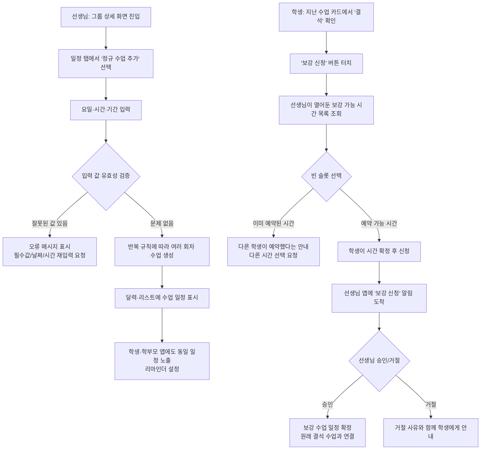

#

# [기획서] F-003 수업 일정 관리 (이해하기 쉬운 버전)

## 1. 개요 및 목적 (Overview)

**한 줄 요약:**\
과외 선생님·학생·학부모가 “정규 수업·보강·시험 일정”을 카톡/엑셀이 아니라, WeTee 안의 하나의 캘린더에서 안전하게 관리하도록 만드는 기능입니다.

**기획 배경:**

- 지금 현실에서 벌어지는 일들:
  - 수업 약속은 카톡으로, 날짜는 구글 캘린더에, 보강 메모는 엑셀에… 흩어져 있어서 한 번에 보기 어렵습니다.
  - “지난주에 뭐라고 했지?”를 찾으려고 카톡을 끝없이 스크롤하다가, 결국 서로 기억이 달라서 오해가 생깁니다.
  - 감기, 연휴, 학교 행사, 시험기간이 겹치면 결석·보강·시간 변경이 뒤엉켜서 수업을 빼먹거나 이중 예약이 나는 사고가 발생합니다.
- 특히 문제 정의서에서 말하는:
  - P1: 도구 파편화(카톡·엑셀·캘린더에 흩어진 정보)
  - P2: 일정 조율/보강 관리의 복잡성\
    이 두 가지를 실질적으로 줄이는 것이 이 기능의 목표입니다.

**기대 효과:**

- 선생님 입장
  - “이번 달에 이 학생 수업 몇 번 했지?”를 한 화면에서 바로 확인할 수 있습니다.
  - 정규 수업을 한 번만 등록하면, 매주 반복 일정이 자동으로 생성되고, 연휴·휴강 같은 예외도 깔끔하게 처리됩니다.
  - 보강 가능한 시간을 미리 열어두면, 학생이 직접 선택해서 신청하므로 카톡으로 시간 조율하는 피로가 줄어듭니다.
- 학생·학부모 입장
  - “다음 수업 언제예요?”라고 매번 물어보지 않아도, 앱에서 이번 주·이번 달 수업과 시험 일정을 한 번에 볼 수 있습니다.
  - 결석 후 보강이 언제 잡혔는지, 시험 대비 수업이 어떻게 배치됐는지 한눈에 확인할 수 있습니다.
- 서비스 입장
  - 출결(F-004), 진도(F-005), 정산(F-006), 알림(F-008)의 “시간표 기준점”을 하나로 통일해, 뒤에 나오는 기능들이 흔들리지 않는 기반을 제공합니다.
  - “실제 진행된 수업 수”와 “정산 금액”을 자동으로 연결하기 위한 최소 단위가 됩니다.

## 2. 사용자 스토리 (User Stories)

캘린더 기능은 여러 사람이 동시에 쓰는 만큼, 각 역할별로 어떤 상황에서 무엇을 원하는지부터 정리합니다.

### 2.1 주요 사용자 스토리 테이블

| ID역할어떤 상황에서무엇을 하고 싶다기대 결과 |     |                                        |                                                         |                                                |
| ------------------------- | --- | -------------------------------------- | ------------------------------------------------------- | ---------------------------------------------- |
| US-01                     | 선생님 | 새 과외를 시작해 요일과 시간을 정한 직후                | 매주 반복되는 정규 수업 일정을 한 번에 등록하고 싶다                          | 약속한 요일·시간이 앞으로 쭉 자동 생성되고, 학생·학부모 앱에도 같이 보인다    |
| US-02                     | 학생  | 감기로 한 번 결석한 뒤                          | “보강 가능한 시간” 중 내게 맞는 시간을 직접 골라 예약하고 싶다                   | 선생님과 카톡 오가며 시간 맞추지 않고, 앱에서 보강이 확정된다            |
| US-03                     | 선생님 | 최근에 여러 학생이 결석이 많아, 주말에 보강을 몰아서 하고 싶을 때 | 주말 시간대를 한 번에 “보강 가능 시간”으로 열어두고, 필요한 학생들이 알아서 신청하게 하고 싶다 | 보강 수업이 자동으로 채워지고, 누구에게 어떤 보강을 해줘야 하는지 헷갈리지 않는다 |
| US-04                     | 선생님 | 학생의 중간·기말 시험 일정을 전달받았을 때               | 시험 기간과 과목을 기록해두고, 시험 전에는 어느 과목 위주로 수업할지 계획하고 싶다         | 달력에서 시험 기간이 눈에 들어오고, 시험 대비 수업이 그 앞쪽에 잘 배치된다    |
| US-05                     | 선생님 | 가족 행사나 갑작스러운 일정으로 수업 날짜를 하루 미루고 싶을 때   | “언제 → 언제로 바꾼다”는 것을 학생에게 정식으로 알리고 기록에도 남기고 싶다            | 변경된 일시와 사유가 학생·학부모 앱에 함께 표시되어 오해가 줄어든다         |
| US-06                     | 학생  | 이번 주·이번 달에 내 수업이 언제 있는지 헷갈릴 때          | 한 화면에서 다가오는 수업과 시험을 전부 보고 싶다                            | 카톡으로 묻지 않고도, 앞으로의 일정과 지난 수업 상태를 스스로 확인할 수 있다   |
| US-07                     | 선생님 | 추석 연휴처럼 특정 요일 수업만 하루 쉬고 싶을 때           | “매주 목요일 수업” 전체를 깨지 않고, 특정 날짜 수업 하나만 휴강 처리하고 싶다          | 반복 규칙은 그대로 두고, 그 날짜만 ‘휴강’으로 깔끔하게 표시된다          |

## 3. 프로세스 흐름도 (Flowchart)

캘린더에서 가장 많이 쓰이는 두 가지 흐름을 그림으로 보여줍니다.

1. 선생님이 정규 수업을 등록하는 흐름
2. 학생이 결석 후 보강을 신청하는 흐름



## 4. 상세 정책 FAQ (Q&A로 푼 비즈니스 규칙)

### 4.1 반복 수업·휴강 관련

**Q. 매주 월·수 수업을 한 번에 등록할 수 있나요?**\
A. 가능합니다. 요일(월/수), 시작 시간, 수업 시간, 시작일, 끝나는 시점(언제까지 할지)을 한 번만 입력하면, 시스템이 앞으로의 월·수 수업을 자동으로 여러 개 생성합니다.

**Q. 추석처럼 특정 요일 수업만 하루 쉬고 싶을 때는 어떻게 되나요?**\
A. 달력에서 해당 날짜 수업을 선택하고 “이 일정만 취소”를 누르면 됩니다. 전체 반복 규칙은 유지되고, 그 날짜의 수업 하나만 ‘휴강(취소)’ 상태로 바뀝니다.

**Q. “끝나는 날 없이 계속”이라는 설정도 가능한가요?**\
A. 가능합니다. 다만 시스템은 한 번에 아주 먼 미래까지 만들지 않고, 앞으로 몇 달 치까지만 만들어 둔 뒤, 자동으로 조금씩 더 늘려 나가는 방식으로 동작합니다. 너무 오래된 수업까지 한 번에 관리하려다 성능이 떨어지는 것을 막기 위한 설계입니다.

### 4.2 일정 변경·취소 관련

**Q. 수업 시작 1시간 전에 날짜를 바꾸고 싶으면 어떻게 되나요?**\
A. 앱에서는 바꿀 수 없습니다. 정책상 “수업 시작 24시간 전까지만” 날짜·시간 변경이 가능하며, 그 이후에는 직접 연락(전화/카톡)으로만 조율하도록 안내합니다. 일정카드에서 변경 버튼은 비활성화되고, “앱에서는 24시간 전까지만 변경 가능합니다”라는 메시지가 뜹니다.

**Q. 이미 끝난(완료된) 수업도 시간을 고칠 수 있나요?**\
A. 일반 사용자(선생님/학생/학부모)는 수정할 수 없습니다. 출결·진도·정산이 엮여 있기 때문에, 과거 수업을 마음대로 고치면 돈과 데이터가 함께 꼬이게 됩니다. 꼭 필요한 경우에는 운영자 전용 도구에서 예외적으로 처리하도록 설계합니다.

**Q. 수업을 취소할 때 이유를 꼭 써야 하나요?**\
A. 네, 간단히라도 이유를 적어야 합니다. “개인 사정”, “학생 요청” 등 최소 글자 수를 요구해, 나중에 기록을 보더라도 왜 취소됐는지 서로 이해할 수 있도록 돕습니다.

### 4.3 보강 수업 관련

**Q. 학생이 보강을 신청했다가 마음이 바뀌면 언제까지 취소할 수 있나요?**\
A. 원칙은 정규 수업과 같습니다. 보강도 “시작 24시간 전까지만” 앱에서 취소할 수 있고, 그 이후에는 선생님께 직접 연락해 조율해야 합니다.

**Q. 한 보강 시간대에 학생이 여러 명 몰리면 어떻게 되나요?**\
A. 한 번에 한 명만 예약할 수 있습니다. 두 번째 학생이 같은 시간을 누르면 “이미 예약된 시간입니다. 다른 시간을 선택해주세요.”라는 안내가 나오고, 그 시간대는 선택할 수 없게 표시됩니다.

**Q. 선생님이 보강 가능한 시간대를 많이 열어두면 문제가 되지 않나요?**\
A. 시스템이 한번에 너무 많은 시간대를 관리하지 않도록, 선생님 한 명이 동시에 열어둘 수 있는 보강 시간대 수에 상한을 둡니다(예: 최대 20개). 너무 많은 ‘열려 있는 시간대’가 생기면, 선생님도 관리하기 어려워지고 일정 충돌 위험이 올라가기 때문입니다.

### 4.4 시험 일정 관련

**Q. 시험 일정은 누가 등록하나요? 학생도 직접 넣을 수 있나요?**\
A. MVP 단계에서는 선생님이 등록합니다. 학교·학년별 시험 일정은 다르기 때문에, 우선 선생님이 확인한 일정만 넣도록 해서 정보의 정확도를 먼저 확보하는 방향입니다. 추후 학생이 직접 입력하는 기능은 별도 검토합니다.

**Q. 시험 기간이 길게 잡혀 있으면 달력이 너무 지저분해지지 않나요?**\
A. 시험은 기간 단위로 표시하되, 한 학생 기준으로 동시에 등록할 수 있는 시험 개수를 제한합니다(예: 최대 10개). 또, 시험 기간이 지나치게 길면(예: 한 달 이상) 경고를 띄워 잘못 입력한 건 아닌지 다시 확인하도록 합니다.

### 4.5 돈·정산과의 관계

**Q. 수업이 ‘완료’로 표시되면, 그 순간 수업료가 차감되는 건가요?**\
A. WeTee 안에서는 “완료된 수업 횟수”가 정산 기능(F-006)에서 사용하는 핵심 기준이 됩니다.

- ‘완료’로 표시된 수업: 정산 대상(수업 1회로 계산)
- ‘취소’로 표시된 수업: 기본적으로 정산에서 제외
- ‘예정’ 상태: 아직 정산에 반영되지 않음

정확히 어떤 조건에서 얼마를 청구할지는 F-006 정산 정책에서 정의하지만, 이 F-003에서 다루는 “상태 값”이 돈과 직접 연결된다고 보면 됩니다.

**Q. 24시간 이내에 취소한 수업에 대해서는 위약금이나 일부 청구를 하고 싶으면요?**\
A. 이 기능에서는 “어떤 수업이 언제 진행/취소되었는지”까지 정확히 기록하고, 실제로 얼마를 청구할지는 정산 기능(F-006)에서 정책으로 정의하게 됩니다. 예를 들어, F-006에서 “수업 시작 24시간 이내 취소는 50% 청구” 같은 규칙을 만들면, 그 근거 데이터가 바로 여기서 제공됩니다.

## 5. 화면 구성안 (UI 중심)

아래는 실제 화면을 그리지 않고도, 어떤 구성이 들어가야 하는지 이해할 수 있도록 정리한 내용입니다.

### 5.1 달력 메인 화면 (선생님·학생 공통)

- 상단
  - “이번 주 일정” 또는 “달력” 제목
  - 월간/주간/리스트 뷰 전환 토글
- 달력 영역
  - 날짜별 수업 개수 뱃지 표시 (예: ● 2)
  - 시험 기간이 포함된 날짜는 배경색 또는 작은 “시험” 뱃지 노출
- 하단 일정 리스트
  - 선택한 날짜의 수업 카드들
    - 시간 (예: 19:00–21:00)
    - 상대방(선생님/학생 이름)
    - 상태 뱃지 (예정/완료/결석/보강 등)
    - 시험 대비 수업인 경우 별도 표시
- 주요 인터랙션
  - 날짜 탭: 해당 날짜 일정 리스트 갱신
  - 일정 카드 탭: 상세 화면으로 이동
  - 선생님일 때 일정 카드 롱프레스: “일정 변경/취소”, “메모 수정” 메뉴 노출

### 5.2 정규 수업 등록 화면 (선생님)

- 상단
  - 제목: “정규 수업 등록”
- 입력 폼
  - 학생/그룹: 현재 그룹이면 자동 선택, 필요 시 변경 가능
  - 요일 선택: 월\~일 버튼, 다중 선택 가능
  - 시작 시간: 시간 선택 드롭다운
  - 수업 시간: 30분 단위 선택 (예: 60분, 90분, 120분)
  - 시작일: 달력에서 날짜 선택 (오늘 이후만 선택 가능)
  - 끝나는 방식
    - “언제까지” (종료일 선택)
    - “몇 번” (횟수 입력)
    - “정해지지 않음” (무한 반복, 경고 문구 함께 표시)
  - 장소/메모: 선택 입력
- 하단
  - “예상 수업 횟수: N회” 안내
  - “등록하기” 버튼 (필수값 입력 전까지 비활성화)

### 5.3 보강 시간 오픈 화면 (선생님)

- 상단
  - 제목: “보강 가능 시간 열기”
- 입력 영역
  - 대상 그룹 선택: 전체/특정 그룹
  - 시간대 리스트
    - 각 행에 날짜, 시작 시간, 종료 시간
    - 삭제(×) 아이콘
  - “+ 시간대 추가” 버튼으로 행 추가
- 하단
  - “동시에 열어둘 수 있는 시간대: 최대 20개” 안내
  - “열기” 버튼: 저장 후, 해당 학생들에게 알림 발송

### 5.4 보강 신청 화면 (학생)

- 상단
  - 제목: “보강 가능한 시간”
- 목록 영역
  - 각 시간대 카드
    - 날짜/시간
    - “신청 가능” 또는 “다른 학생이 예약함” 상태 표시
- 인터랙션
  - 신청 가능한 카드 탭:
    - “이 시간으로 보강을 신청하시겠어요?” 확인 팝업
    - “확인” 시 신청 완료, 카드 상태가 “승인 대기”로 변경
  - 이미 예약된 카드: 비활성화 및 안내 문구 표시

### 5.5 시험 일정 관리 화면 (선생님)

- 상단
  - 제목: “시험 일정 관리”
- 리스트
  - 시험 카드
    - 시험명 (예: 2학기 중간고사)
    - 기간(11/20–11/25)
    - 과목 뱃지 (수학/영어/과학 등)
    - D-Day 표시 (D-7 등)
    - 수정/삭제 아이콘
- 하단
  - “+ 시험 추가” 버튼
- 시험 상세/추가 화면
  - 시험명, 학교, 기간, 과목 체크박스, 메모
  - “저장” 버튼

### 5.6 “안 되는 기능” 안내 UI

- Case A: 학생이 일정 카드를 눌렀을 때
  - 일정 상세 하단 문구:
    - “일정 변경은 선생님께 직접 문의해주세요.”
  - 바로 옆에 전화/카톡 아이콘을 두어, 여기서 곧장 연락할 수 있게 배치
- Case B: 선생님이 수업 시작 24시간 이내에 변경 시도
  - 변경 버튼 탭 시 토스트:
    - “수업 24시간 전까지만 앱에서 변경 가능합니다. 학생과 직접 연락해주세요.”
  - 변경 버튼은 비활성화 상태 유지, 회색 처리
  - 회색 버튼 아래에 작은 설명 텍스트: “정책상 24시간 이내 변경은 직접 연락만 가능”\


[여기서부터 원본 데이터]

# F-003 수업 일정 관리 – 기능 명세서 (리마스터)

## 0. 메타 정보

- 기능 ID: F-003 수업 일정 관리
- 버전: v2.0 (리마스터)
- 기준 문서: F-003\_수업\_일정\_관리 v1.1 (2025-11-11)
- 우선순위: 1단계 MVP
- 선행 기능: F-001 회원가입 및 로그인, F-002 과외 그룹 생성 및 매칭
- 후행 기능: F-004 출결 관리, F-005 수업 기록 및 진도 관리, F-006 수업료 정산, F-008 필수 알림 시스템

## 1. 기능 개요

### 1.1 한 문장 요약

F-003은 과외 그룹별 수업·보강·시험 일정을 한 캘린더에서 관리하는 기능이다. 선생님은 정규 수업과 보강 시간을 체계적으로 등록·변경하고, 학생은 보강 가능 시간 중에서 원하는 슬롯을 예약할 수 있다. 이를 통해 카카오톡·엑셀·캘린더에 흩어져 있던 일정 관리와 수업 빼먹음/이중 예약 문제를 줄인다.

### 1.2 문제 정의 문서와의 연결 (P1·P2 중심)

이 기능은 문제 정의서에서 특히 다음 문제를 직접적으로 다룬다.

- P2: 일정 조율 및 보강 수업 관리의 복잡성

  - 카톡/전화로 구두 일정 조율을 하다 보니, 합의 내용을 다시 찾기 어렵고 착오가 빈번히 발생한다.
  - 보강 수업의 경우, 선생님이 보강 하루 전·당일 아침에 매번 카톡으로 리마인드를 보내야 하는 번거로움이 있다.
  - 연휴·방학 기간에는 결석·보강이 뒤섞여 일정 변동이 많아, 꼼꼼히 정리하지 않으면 두 학생 수업을 빼먹는 등 실수가 발생한다.

- P1: 도구 파편화·인지 부하 (간접 해결)

  - 구글 캘린더, 엑셀, 카카오톡 대화창, 메신저 메모장 등 여러 도구에 일정과 시험 정보를 나누어 적으면서, 한 시점의 전체 그림을 보기 어렵다.

F-003의 목표는 다음과 같다.

- 정규 수업·보강 수업·시험 일정이 하나의 타임라인 안에서 보이게 한다.
- 보강 시간 조율을 구조화된 플로우(시간 오픈 → 학생 예약 → 선생님 승인)로 바꾸어, 카톡 대화 스크롤 의존도를 줄인다.
- 시험 일정과 수업 일정이 함께 보이도록 하여, “시험 전 집중 수업”과 같은 전략적 운영이 가능하도록 한다.
- 이를 통해 문제 정의서 P1에서 언급된 '구글 캘린더 + 카카오톡 + 엑셀' 조합 대신 WeTee 일정 화면 하나를 일정 관리의 기준점으로 사용하게 만드는 것을 목표로 한다.

### 1.3 02 해결 방향 및 Pillar와의 연결

02\_solution\_value\_prop에서 정의한 Pillar 중 F-003은 다음에 속한다.

- Pillar 1: 통합 과외 운영
  - 일정, 출결, 진도, 정산, 알림을 한 타임라인 위에서 관리하는 것을 목표로 한다.
  - F-003은 이 타임라인의 "언제, 어느 그룹에서, 어떤 유형의 수업이 있는지"를 정의하는 시간 축 역할을 한다.

F-003이 제공하는 `schedule_id`는 이후 기능의 기준 키가 된다.

- F-004 출결 관리: 일정별 출석 상태를 연결
- F-005 수업 기록 및 진도 관리: 일정별 수업 내용·진도를 연결
- F-006 수업료 정산: 실제 진행된 일정 수를 기준으로 과외비 계산
- F-008 필수 알림 시스템: 일정 생성/변경/취소/보강에 따른 알림 트리거로 활용

### 1.4 선행/후행 기능과의 연결

- 선행 기능(F-003이 의존)

  - F-001 회원가입 및 로그인
    - User, Role(TEACHER/STUDENT/PARENT) 및 인증/인가 제공
  - F-002 과외 그룹 생성 및 매칭
    - Group, GroupMember, InviteCode 정의
    - F-003의 모든 일정은 반드시 특정 Group에 속하며, GroupMember를 통해 참여자를 정의한다.

- 후행 기능(F-003을 사용하는 기능)

  - F-004 출결 관리: 각 Schedule을 기준으로 출결을 1:1로 기록
  - F-005 수업 기록 및 진도 관리: Schedule별 수업 내용·진도 연결
  - F-006 과외비 자동 정산: COMPLETED 상태 일정 수를 기준으로 과외비 계산
  - F-008 필수 알림 시스템: 일정 리마인더, 변경·취소, 보강 신청/승인 알림 발송

### 1.5 범위(Scope)와 비범위(Out of Scope)

포함 범위(MVP 기준):

- 그룹 단위 정규 수업 일정 등록 (반복 규칙 포함)
- 보강 가능 시간대 오픈 및 보강 수업 예약/승인 플로우
- 학생별 시험 일정 등록 및 달력 상 시험 기간 표시
- 선생님·학생·학부모의 일정 조회(달력 뷰, 리스트 뷰)
- 일정 변경/취소 규칙, 예외 처리, 기본 알림 트리거 정의

비범위(다른 기능 또는 차기 단계에서 담당):

- 출석 상태(PRESENT/LATE/ABSENT 등) 및 출결 통계: F-004에서 정의
- 수업 내용/진도 기록 및 리포트: F-005에서 정의
- 과외비 계산·정산 로직: F-006에서 정의
- 외부 캘린더(구글/애플) 동기화: 2단계 이후 고려
- AI 기반 자동 일정 추천, 공휴일 자동 스킵, 그룹 과외 등: 향후 기능으로 분리

## 2. 용어 정의

- 정규 수업 일정(Regular Lesson Schedule)

  - 특정 과외 그룹에서 정기적으로 진행되는 기본 수업 일정.
  - 예: 매주 월·수 19:00–21:00, 3개월간.

- 보강 가능 시간(Makeup Available Slot)

  - 선생님이 보강 수업을 진행할 수 있는 시간대를 미리 오픈해 둔 슬롯.
  - 학생이 해당 슬롯 중 하나를 예약하면, 실제 보강 수업 일정으로 확정된다.

- 보강 수업(Makeup Lesson)

  - 결석·취소 등으로 인해 추가로 진행되는 수업.
  - 원래 정규 수업 일정과 1:1로 연결될 수 있다.

- 시험 일정(Exam Period)

  - 특정 학생의 학교 시험 기간과 시험 과목 정보를 구조화하여 기록한 일정.
  - 예: 3월 15–18일 중간고사(수학·영어·과학).

- 일정 유형(ScheduleType)

  - 일정의 성격을 구분하는 타입 값.
  - 예: REGULAR\_LESSON, MAKEUP\_LESSON, EXAM\_PREP 등.

- 일정 상태(ScheduleStatus)

  - 일정의 현재 상태를 나타내는 값.
  - 예: PLANNED, CANCELLED, COMPLETED.

- 반복 규칙(Recurrence Rule)

  - 정규 수업 일정을 여러 회차로 자동 생성하기 위한 규칙.
  - frequency, interval, days\_of\_week, end\_type, end\_count/end\_date 등으로 구성.

- 보강 신청(Makeup Request)

  - 학생이 오픈된 보강 가능 시간 중 하나를 선택해 요청한 상태.

- 보강 승인(Makeup Approval)

  - 선생님이 보강 신청을 승인하여 실제 수업 일정으로 확정한 상태.

## 3. 사용자 시나리오 (UI 독립형)

기존 문서의 시나리오 1–6을 F-003 관점에서 정리한다.

### 3.1 시나리오 1 – 선생님이 정규 수업 일정을 처음 등록하는 경우

배경: 김선생님은 "이학생 수학 과외" 그룹을 만들고 이학생을 초대했다. 매주 월·수 오후 3시에 2시간씩 수업하기로 약속했고, 이를 앱에 등록하려 한다.

전제 조건:

- 선생님이 로그인되어 있다.
- "이학생 수학 과외" 그룹이 존재하며, 이학생이 GroupMember로 참여 중이다.
- 아직 해당 그룹에 등록된 수업 일정이 없다.

주요 흐름:

1. 선생님은 "이학생 수학 과외" 그룹 상세 화면으로 이동한다.
2. "일정" 탭에서 "정규 수업 추가" 버튼을 선택한다.
3. 정규 수업 등록 화면에서 다음 정보를 입력한다.
   - 요일: 월요일, 수요일
   - 수업 시작 시각: 오후 3시
   - 수업 시간: 120분
   - 시작일: 다가오는 월요일
   - 종료 조건: 종료일 지정 또는 횟수 지정
   - 수업 장소, 메모(선택)
4. 시스템은 필수 필드, 시간 유효성, 종료 조건 등을 검증한다.
5. 검증을 통과하면 반복 규칙에 따라 개별 Schedule들을 생성한다.
6. 생성된 일정들은 그룹의 달력 뷰와 리스트 뷰에 표시되며, 학생 측 앱에도 동일하게 표시된다.
7. 각 일정에는 기본 리마인더가 설정된다.

결과:

- 매주 월·수 정규 수업 일정이 자동으로 여러 회차 생성된다.
- 이후 출결, 진도, 정산 및 알림 기능이 이 일정들을 기준으로 동작한다.

### 3.2 시나리오 2 – 학생이 결석 후 보강 수업을 신청하는 경우

배경: 이학생은 11월 6일 수업을 감기로 결석했다. 선생님은 출결 기능에서 해당 일정을 "결석"으로 처리했고, 보강 가능 시간도 미리 오픈해둔 상태이다.

전제 조건:

- 11월 6일 정규 수업 일정이 존재하며, 출결 상태가 "결석"이다.
- 선생님이 11월 9일·10일 일부 시간대를 보강 가능 시간으로 오픈했다.

주요 흐름:

1. 학생은 "일정" 탭에서 11월 6일 수업 카드의 상태(결석)를 확인한다.
2. 수업 카드의 "보강 신청" 버튼을 누른다.
3. 시스템은 선생님이 오픈한 보강 가능 시간 리스트를 보여준다.
4. 학생은 원하는 시간대(예: 11월 9일 10:00–12:00)를 선택한다.
5. 시스템은 선택 시간에 다른 예약이 없는지 확인한 뒤, 보강 신청을 생성한다.
6. 선생님은 알림을 통해 신청 내용을 확인하고, 승인 또는 거절한다.
7. 승인 시 해당 시간대가 보강 수업 일정으로 확정되며, 원래 결석 일정과 연결된다.

결과:

- 결석한 수업에 대한 보강이 체계적으로 기록·관리된다.
- 카카오톡으로 시간 조율을 반복할 필요가 줄어든다.

### 3.3 시나리오 3 – 선생님이 보강 가능한 시간대를 오픈하는 경우

배경: 김선생님은 주말에 시간이 비어서 보강 수업을 진행할 수 있다. 학생들이 필요에 따라 예약할 수 있도록 시간대를 오픈하려 한다.

전제 조건:

- 선생님이 여러 그룹을 운영 중이며, 일부 학생은 최근 결석 기록이 있다.

주요 흐름:

1. 선생님은 대시보드의 "일정" 섹션에서 "보강 시간 오픈"을 선택한다.
2. 대상 그룹 범위를 선택한다.
   - 전체 그룹 또는 특정 그룹
3. "+ 시간대 추가"를 눌러 여러 개의 보강 가능 시간대를 입력한다.
   - 각 시간대별 날짜, 시작/종료 시각, 장소(선택)
4. 시스템은 각 시간대의 유효성을 검증한다.
5. 선생님이 "오픈하기"를 누르면, 대상 학생들에게 보강 가능 시간 알림이 발송된다.
6. 학생들이 각자 필요한 시간대를 선택·신청하면, 해당 슬롯의 상태가 실시간으로 변한다.

결과:

- 선생님이 주말 등 특정 구간을 한 번에 오픈하여 여러 학생의 보강 수요를 효율적으로 처리할 수 있다.

### 3.4 시나리오 4 – 선생님이 학생의 시험 일정을 등록하는 경우

배경: 이학생의 기말고사 일정(11월 20–25일)을 전달받은 선생님이, 이를 앱에 기록해 시험 전 대비 수업을 계획하고자 한다.

전제 조건:

- 해당 학생이 속한 그룹이 존재한다.

주요 흐름:

1. 선생님은 그룹 상세 화면의 "일정" 탭에서 "시험 일정" 버튼을 선택한다.
2. "시험 일정 관리" 화면에서 "+ 시험 추가"를 선택한다.
3. 시험명, 학교, 시험 기간, 시험 과목, 메모 등을 입력한다.
4. 등록 후 달력에서 시험 기간 구간에 시험 뱃지가 표시된다.
5. 시험 기간 전 일정들은 "시험 대비 수업"으로 태깅되거나 강조 표시될 수 있다.
6. 학생 앱에서도 같은 시험 정보와 D-day가 표시된다.

결과:

- 학생별 시험 일정을 구조화하여 기록할 수 있으며, 이를 바탕으로 수업 계획을 최적화할 수 있다.

### 3.5 시나리오 5 – 선생님이 급한 사정으로 일정을 변경하는 경우

배경: 11월 11일 수업이 예정되어 있었지만, 선생님이 가족 일정으로 수업을 다음 날로 옮기려 한다.

전제 조건:

- 11월 11일 일정이 존재하고, 수업 시작 24시간 이전이다.

주요 흐름:

1. 선생님은 "일정" 탭에서 해당 수업 카드를 길게 누르거나 상세 화면으로 진입한다.
2. 메뉴에서 "일정 변경"을 선택한다.
3. 새로운 날짜/시간과 변경 사유를 입력한다.
4. 시스템은 변경 가능 시간인지(24시간 이전, 시간 충돌 여부 등)를 검증한다.
5. 검증 통과 시 일정이 새로운 시간으로 업데이트된다.
6. 학생에게 일정 변경 알림과 변경 사유가 전달된다.

결과:

- 일정 변경이 구조화된 기록으로 남으며, 변경 사유를 명시해 투명성을 확보한다.

### 3.6 시나리오 6 – 학생이 다가오는 수업 일정을 확인하는 경우

배경: 학생이 이번 주에 수업이 언제 있는지 확인하고자 한다.

전제 조건:

- 정규 수업 일정이 등록되어 있다.

주요 흐름:

1. 학생은 홈 화면의 "다가오는 수업" 위젯에서 다음 수업 일시를 확인한다.
2. 위젯을 탭하여 "일정" 화면으로 이동한다.
3. 기본으로 주간 달력 뷰 또는 리스트 뷰가 표시된다.
4. 각 일정 카드에서 날짜/시간, 선생님 이름, 상태(예정/완료/결석 등)를 확인한다.
5. 필요 시 일정 상세 화면으로 진입해 장소, 메모 등을 확인한다.

결과:

- 학생이 카카오톡으로 "다음 수업 언제였죠?"라고 묻지 않고도 앱에서 모든 정보를 확인할 수 있다.

### 3.7 시나리오 7 – 반복 일정 중 특정일 휴강 처리

배경: 김선생님은 매주 목요일 19:00에 진행되는 정규 수업이 있는데, 추석 연휴로 9월 28일 수업 하루만 쉬고 싶다.

전제 조건:

- "매주 목요일 19:00" 정규 수업 반복 일정이 RecurrenceRule로 등록되어 있다.
- 9월 28일(목)에 해당하는 Schedule 인스턴스가 PLANNED 상태로 생성되어 있다.

주요 흐름:

1. 선생님은 달력 화면에서 9월 28일 날짜를 선택한다.
2. 해당 날짜의 수업 일정 카드(목요일 정규 수업)를 탭하여 상세 화면으로 진입한다.
3. 메뉴에서 "이 일정만 취소"를 선택한다.
4. 취소 사유 입력 팝업에 "추석 연휴" 등 사유를 입력한다.
5. 시스템은 수업 시작 24시간 이전인지, 다른 일정과의 충돌은 없는지 검증한다.
6. 검증을 통과하면 해당 Schedule 인스턴스 하나의 상태를 CANCELLED로 변경하고, 취소 사유를 기록한다.

결과:

- RecurrenceRule 자체는 그대로 유지되며, 9월 28일에 해당하는 일정 인스턴스만 CANCELLED 상태로 예외 처리된다.
- 나머지 목요일 정규 수업 일정들은 PLANNED 상태로 유지되어 정상 진행된다.

효과:

- 반복 규칙을 깨지 않고 개별 인스턴스만 제어할 수 있다는 점을 개발자와 디자이너에게 명확히 전달한다.

## 4. 예외 상황 및 에러 처리

기존 문서의 "이 기능에서 일어날 수 있는 문제들"을 기능별 예외 처리 관점으로 재구성한다.

### 4.1 정규 수업 등록 시 예외 상황

| 문제 상황               | 사용자 메시지                               | 시스템 동작               | 비고       |
| ------------------- | ------------------------------------- | -------------------- | -------- |
| 필수 필드(요일, 시간) 비워둠   | "필수 항목을 모두 입력해주세요"                    | 비어 있는 필드를 강조         | -        |
| 수업 시간이 0분           | "수업 시간을 입력해주세요"                       | 입력 필드에 경고 표시         | -        |
| 시작일이 과거 날짜          | "시작일은 오늘 이후로 선택해주세요"                  | 날짜 선택기에서 과거 날짜 선택 제한 | -        |
| 종료일이 시작일보다 빠름       | "종료일은 시작일 이후여야 합니다"                   | 재선택 요구               | -        |
| 종료 조건 미선택           | "종료 조건을 선택해주세요"                       | 라디오 버튼 영역 강조         | -        |
| 횟수가 1000회 초과        | "횟수는 1000회 이하로 입력해주세요. 종료일 지정을 권장합니다" | 경고 표시                | 대량 생성 방지 |
| 선택한 요일이 없음          | "최소 한 개의 요일을 선택해주세요"                  | 요일 선택 UI 강조          | -        |
| 그룹에 학생이 없음          | "먼저 학생을 초대해주세요"                       | F-002 초대 화면으로 이동     | 그룹 선행 조건 |
| 같은 시간에 다른 학생 수업이 겹침 | "이 시간에 이미 다른 수업이 있습니다. 시간을 변경하시겠어요?"  | 경고 표시, 시간 변경 유도      | 일정 충돌 감지 |
| 네트워크 오류             | "네트워크 연결을 확인해주세요"                     | 재시도 버튼 제공, 입력 데이터 보존 | -        |

### 4.2 보강 수업 관련 예외 상황

| 문제 상황                     | 사용자 메시지                                       | 시스템 동작           | 비고          |
| ------------------------- | --------------------------------------------- | ---------------- | ----------- |
| 오픈된 보강 시간이 없음 (학생)        | "현재 예약 가능한 보강 시간이 없습니다. 선생님께 문의해주세요"          | 빈 상태 안내 + 도움 텍스트 | -           |
| 이미 예약된 시간 선택              | "이 시간은 이미 다른 학생이 예약했습니다. 다른 시간을 선택해주세요"       | 해당 시간 비활성화       | 동시 예약 방지    |
| 보강 시간이 과거 날짜              | "과거 날짜는 선택할 수 없습니다"                           | 날짜 필터링           | -           |
| 보강 시간 오픈 시 시작 > 종료        | "종료 시간이 시작 시간보다 빠릅니다"                         | 재입력 요구           | -           |
| 같은 시간에 정규 수업이 있음          | "이 시간에 이미 정규 수업이 있습니다. 다른 시간을 선택해주세요"         | 시간 충돌 경고 또는 차단   | 정책에 따라 결정   |
| 학생이 보강 신청 후 24시간 이내 취소 시도 | "보강 수업은 24시간 전까지만 취소할 수 있습니다. 선생님께 직접 문의해주세요" | 취소 버튼 비활성화       | 급작스러운 취소 방지 |

### 4.3 일정 변경/취소 예외 상황

| 문제 상황               | 사용자 메시지                                     | 시스템 동작     | 비고      |
| ------------------- | ------------------------------------------- | ---------- | ------- |
| 수업 시작 24시간 이내 변경 시도 | "수업 24시간 전까지만 앱에서 변경 가능합니다. 학생과 직접 연락해주세요." | 변경 버튼 비활성화 | 학생 보호   |
| 변경 사유 미입력           | "변경 사유를 입력해주세요"                             | 필수 입력 강조   | 투명성 확보  |
| 이미 완료된 수업 변경 시도     | "완료된 수업은 변경할 수 없습니다"                        | 변경 불가 안내   | 데이터 무결성 |
| 새 일정이 다른 수업과 겹침     | "변경하려는 시간에 이미 다른 수업이 있습니다. 다른 시간을 선택해주세요"   | 시간 충돌 감지   | -       |
| 수업 취소 시 사유 미입력      | "취소 사유를 입력해주세요"                             | 필수 입력 강조   | -       |
| 네트워크 오류             | "일정 변경에 실패했습니다. 네트워크 연결을 확인해주세요"            | 재시도 옵션 제공  | -       |

### 4.4 시험 일정 관련 예외 상황

| 문제 상황              | 사용자 메시지                                  | 시스템 동작   | 비고        |
| ------------------ | ---------------------------------------- | -------- | --------- |
| 시험 기간이 과거 날짜       | "시험 기간은 오늘 이후로 입력해주세요"                   | 날짜 제한    | -         |
| 시험 종료일이 시작일보다 빠름   | "시험 종료일을 확인해주세요"                         | 재입력 요구   | -         |
| 시험명 미입력            | "시험명을 입력해주세요"                            | 필수 입력 강조 | -         |
| 같은 기간에 다른 시험 존재    | "이 기간에 이미 다른 시험이 등록되어 있습니다. 계속 추가하시겠어요?" | 확인 다이얼로그 | 중복 방지용 경고 |
| 시험 기간이 비정상적으로 긴 경우 | "시험 기간이 너무 깁니다. 종료일을 확인해주세요"             | 경고 표시    | 실수 방지     |

### 4.5 일정 조회 예외 상황

| 문제 상황                 | 사용자 메시지                           | 시스템 동작                     | 비고    |
| --------------------- | --------------------------------- | -------------------------- | ----- |
| 등록된 일정이 전혀 없음         | "아직 일정이 없습니다. 첫 수업을 등록해보세요!"      | 빈 상태 화면 + 정규 수업 추가 버튼      | 온보딩   |
| 선택한 기간에 일정 없음         | "이 기간에는 일정이 없습니다"                 | 빈 달력 표시                    | -     |
| 과거 일정 조회 시 너무 오래된 데이터 | 별도 에러 없음                          | 최대 1년 전까지 조회, 그 이상은 잘라서 제공 | 성능 고려 |
| 네트워크 오류               | "일정을 불러올 수 없습니다. 네트워크 연결을 확인해주세요" | 재시도 버튼 제공                  | -     |

## 5. 비즈니스 규칙

기존 문서의 규칙을 구조적으로 재배치한다.

### 5.1 정규 수업 일정 규칙

- 요일 선택
  - 최소 1개 이상, 최대 7개까지 선택 가능.
- 수업 시간
  - 최소 30분, 최대 300분(5시간).
  - 단위: 30분 단위.
- 시작일
  - 오늘 또는 미래 날짜만 허용.
- 종료 조건
  - 종료일 지정: 최대 2년 후까지.
  - 횟수 지정: 1\~1000회까지.
  - 종료일 없음: 무한 반복 설정 가능하나, 경고 문구 표시.
- 반복 생성 제한
  - 한 번 등록 시 최대 200개의 개별 수업을 자동 생성.

### 5.2 반복 일정 규칙 (예시 및 저장 형식)

반복 규칙은 frequency, interval, days\_of\_week, start\_date, end\_type, end\_count/end\_date 등으로 정의한다.

- 예시 1: 매주 월/수/금 반복

```json
{
  "frequency": "weekly",
  "interval": 1,
  "days_of_week": [1, 3, 5],
  "start_date": "2025-01-06",
  "end_type": "count",
  "end_count": 12
}
```

- 예시 2: 격주 화요일 반복

```json
{
  "frequency": "weekly",
  "interval": 2,
  "days_of_week": [2],
  "start_date": "2025-01-07",
  "end_type": "date",
  "end_date": "2025-12-31"
}
```

- 예시 3: 매일 반복(집중 특강)

```json
{
  "frequency": "daily",
  "interval": 1,
  "days_of_week": [1, 2, 3, 4, 5, 6, 7],
  "start_date": "2025-07-01",
  "end_type": "count",
  "end_count": 30
}
```

- 예시 4: 종료일 없는 무한 반복

```json
{
  "frequency": "weekly",
  "interval": 1,
  "days_of_week": [6],
  "start_date": "2025-01-04",
  "end_type": "never"
}
```

추가 규칙:

- 무한 반복 일정은 최초 등록 시 향후 3개월(또는 최대 200회)까지만 생성하고, 매월 1일 추가 3개월치를 자동 생성한다.
- "종료일 없음" 선택 시 종료일 설정을 권장하는 경고 문구를 함께 표시한다.

### 5.3 보강 수업 규칙

- 보강 가능 시간 오픈

  - 최소 30분, 최대 300분.
  - 오늘부터 4주 후까지의 날짜만 오픈 가능.
  - 선생님 1인당 동시에 오픈 가능한 시간대 수는 최대 20개.

- 보강 신청

  - 수업 24시간 전까지 신청 가능.
  - 취소도 24시간 전까지 가능.
  - 한 시간대에는 한 명의 학생만 예약 가능(선착순).

- 보강 승인

  - 선생님 승인 필수.
  - 거절 시 사유 입력이 필수이며, 학생에게 사유가 전달된다.

### 5.4 일정 변경/취소 규칙

- 변경 가능 시점: 수업 시작 24시간 전까지.
- 취소/변경 사유: 최소 글자 수(예: 5자 이상)를 요구.
- 완료된 수업(COMPLETED 상태)
  - 시간 변경 및 취소 불가.
  - 필요 시 운영자/관리자 기능에서만 예외적으로 수정.

### 5.5 시험 일정 규칙

- 시험 기간
  - 최소 1일, 최대 30일.
  - 오늘 또는 미래 날짜만 허용.
- 시험명
  - 2자 이상 30자 이하.
- 학생당 동시 등록 가능 시험 수
  - 최대 10개.
- 동일 기간 중복 시험 등록
  - 허용하되 경고 다이얼로그 표시.

### 5.6 일정 충돌 규칙

- 같은 시간, 같은 선생님
  - 기본값: 불가. 에러 메시지로 안내.
  - 그룹 수업 기능이 도입되기 전까지는 1인 1수업 원칙.
- 같은 시간, 다른 학생/그룹
  - 정책에 따라 경고만 표시 후 허용하거나, 불허할 수 있다.
- 정규 수업과 보강 수업이 겹치는 경우
  - 기본값: 불가. 에러 처리.
- 정규 수업과 보강 가능 시간 슬롯이 겹치는 경우
  - 경고를 표시하되, 선생님 판단에 따라 허용 가능.

### 5.7 일정 상태 수명 주기(Lifecycle)

- 생성(CREATED / PLANNED)
  - 정규 수업 등록 또는 RecurrenceRule에 의해 개별 Schedule 인스턴스가 PLANNED 상태로 생성된다.
- 수정(MODIFICATION)
  - 수업 시작 24시간 전까지는 날짜/시간/메모 등의 변경이 가능하며, 변경 이력과 변경 사유를 기록한다.
- 예외 처리(EXCEPTION)
  - 반복 일정 중 특정 회차만 휴강하는 경우 등, 개별 Schedule 인스턴스의 상태만 CANCELLED로 변경하고 RecurrenceRule은 유지한다.
- 완료(COMPLETION)
  - 수업 진행 후 출결(F-004)과 수업 기록(F-005)이 확정되면 해당 Schedule을 COMPLETED 상태로 변경한다.
  - COMPLETED 상태의 일정은 F-006 수업료 정산에서 정산 횟수(Billing Count)를 계산할 때 사용된다.

## 6. 데이터 및 상태 정의 (개념 수준)

구체적인 DB 스키마는 백엔드 설계 문서에서 다루되, F-003 기능 명세서에서는 개념적 수준만 정의한다.

### 6.1 Schedule 엔티티(개념)

- id: UUID, 일정 고유 식별자
- group\_id: Group.id (필수)
- teacher\_id: User.id (해당 그룹의 TEACHER)
- type: REGULAR\_LESSON / MAKEUP\_LESSON / EXAM\_PREP 등
- status: PLANNED / CANCELLED / COMPLETED
  - 이 필드는 F-006 수업료 정산에서 정산 대상 여부를 결정하는 핵심 기준으로 사용된다.
  - COMPLETED: 실제로 진행이 완료된 수업으로, 정산 횟수 차감 대상이다(Billing Count +1).
  - CANCELLED: 취소된 수업으로, 기본적으로 정산 대상에서 제외된다. 단, 위약금이나 부분 청구 정책은 F-006에서 정의한다.
  - PLANNED: 아직 진행되지 않은 예정 수업으로, 정산 대기 상태이다.
- start\_at: datetime
- end\_at: datetime
- original\_schedule\_id: UUID, 보강·변경의 원본 일정 참조(선택)
- title: string, 일정 제목(선택)
- note: text, 메모(선택)
- created\_at: datetime
- updated\_at: datetime

### 6.2 RecurrenceRule 엔티티(개념)

- id: UUID
- group\_id: Group.id
- base\_schedule\_template: 기본 수업 시간/길이/장소/메모 템플릿
- frequency: daily/weekly
- interval: 정수
- days\_of\_week: 요일 리스트(1\~7)
- start\_date: date
- end\_type: date/count/never
- end\_date: date(선택)
- end\_count: int(선택)

### 6.3 ExamSchedule 엔티티(개념)

- id: UUID
- group\_id: Group.id
- student\_id: User.id(STUDENT)
- title: string (시험명)
- school\_name: string(선택)
- period\_start: date
- period\_end: date
- subjects: string 리스트(국어/영어/수학 등)
- note: text(선택)

## 7. 권한 및 접근 제어

기존 "사용자별 권한" 섹션을 표 형태로 재구성한다.

### 7.1 기능별 권한 매트릭스

| 기능/행동              | TEACHER                               | STUDENT     | PARENT |
| ------------------ | ------------------------------------- | ----------- | ------ |
| 그룹 정규 수업 일정 등록     | 가능                                    | 불가          | 불가     |
| 정규 수업 일정 수정/취소     | 가능 (자신의 그룹)                           | 불가          | 불가     |
| 보강 가능 시간대 오픈       | 가능                                    | 불가          | 불가     |
| 보강 수업 신청           | 불가                                    | 가능 (자신 일정)  | 불가     |
| 보강 수업 취소(24시간 전까지) | 불가                                    | 가능 (자신 신청분) | 불가     |
| 학생 시험 일정 등록        | 가능 (담당 학생)                            | 불가 (MVP)    | 불가     |
| 내 수업 일정 조회         | 가능 (선생님: 본인 그룹 전체 / 학생: 본인 / 학부모: 자녀) | 가능          | 가능     |
| 다른 학생 일정 조회        | 불가 (본인/자녀 기준만)                        | 불가          | 불가     |

### 7.2 추가 권한 규칙

- 선생님은 자신이 TEACHER로 속한 Group에 한해서만 일정 등록·수정·취소를 할 수 있다.
- 학생은 자신의 GroupMember 정보에 기반하여, 자신에게 속한 그룹의 일정만 조회할 수 있다.
- 학부모는 자녀(STUDENT)의 GroupMember 정보를 통해 자녀의 일정만 조회할 수 있다.
- MVP 단계에서는 보강 수업 신청/취소 권한을 학생(STUDENT)에만 부여하며, 학부모의 직접 신청/변경은 차후 단계 기능으로 검토한다.

## 8. UI 요구사항 (요약)

기존 UI 요구사항을 구조화하여 요약한다.

### 8.1 정규 수업 등록 화면

- 상단: "정규 수업 등록" 제목
- 본문: 입력 폼
  - 학생 선택(그룹 내 단일 학생인 경우 자동 선택)
  - 요일 체크박스(월\~일)
  - 시작 시간 선택기
  - 수업 시간 입력(30분 단위)
  - 시작일/종료일 또는 횟수 입력
  - 장소/메모 입력
- 하단: "등록하기" 버튼(필수 필드 모두 입력될 때까지 비활성화)
- 등록 후 요약 확인 화면에서 예상 수업 횟수 표시

### 8.2 달력 화면 (선생님/학생 공통)

- 월간/주간/리스트 뷰 전환 토글 제공
- 달력 셀
  - 날짜, 해당 날짜 수업 개수 뱃지
  - 시험 기간에는 배경 색상 또는 시험 뱃지 표시
- 일정 카드
  - 시간, 상대방 이름(선생님 또는 학생), 수업 시간, 상태 뱃지, 시험 뱃지
- 인터랙션
  - 셀 탭 시 해당 날짜 일정 리스트 표시
  - 일정 카드 탭 시 수업 상세 화면으로 이동
  - 일정 카드 롱프레스 시 변경/취소/메모 기능 노출(선생님)

### 8.3 보강 시간 오픈 화면 (선생님)

- 대상 그룹 선택 드롭다운
- 시간대 카드 리스트
  - 날짜, 시작/종료 시각, 삭제 버튼
- "+ 시간대 추가" 버튼으로 여러 시간대 추가
- "오픈하기" 버튼으로 일괄 등록 및 학생 알림 발송

### 8.4 보강 신청 화면 (학생)

- 오픈된 시간대 리스트
  - 날짜/시간, 현재 상태(선택 가능/예약됨)
- 선택 가능한 슬롯만 활성화
- 슬롯 탭 시 확인 다이얼로그 후 신청 확정

### 8.5 시험 일정 관리 화면 (선생님)

- 시험 리스트
  - 시험명, 기간, 과목 뱃지, D-day, 수정/삭제 버튼
- "+ 시험 추가" 버튼으로 신규 시험 등록
- 시험 카드 탭 시 상세·수정 화면으로 이동

### 8.6 변경 불가 상황 안내 문구 (MVP)

- Case A (학생이 일정 카드를 터치했을 때)
  - 안내 문구: "일정 변경은 선생님께 직접 문의해주세요."
  - UI: 일정 상세 화면 하단에 전화/카카오톡 아이콘을 노출하여, 바로 연락할 수 있도록 한다.
- Case B (선생님이 수업 시작 24시간 이내에 변경을 시도했을 때)
  - Toast 팝업: "수업 24시간 전까지만 앱에서 변경 가능합니다. 학생과 직접 연락해주세요."
  - UI: 변경 버튼은 비활성화 상태로 유지하고, 왜 비활성화되었는지에 대한 설명을 표시한다.


## 9. 다른 기능 및 문서와의 연결

- F-001 회원가입 및 로그인

  - 모든 일정·시험·보강 관련 API는 인증된 사용자만 접근 가능하다.
  - 사용자 역할(Role)에 따라 권한이 달라진다.

- F-002 과외 그룹 생성 및 매칭

  - 일정은 항상 특정 Group에 속하며, GroupMember가 참여자 범위를 정의한다.
  - 그룹 정보(수업료, 기본 수업 시간 등)는 일정 등록 시 기본값으로 활용될 수 있다.

- F-004 출결 관리

  - 각 Schedule에 대해 출결(출석, 지각, 결석, 보강 완료 등)을 1:1로 연결한다.
  - 결석 일정은 보강 신청 플로우로 이어진다.

- F-005 수업 기록 및 진도 관리

  - COMPLETED 상태의 일정에 대해 수업 내용, 진도, 과제 등의 기록을 연동한다.

- F-006 수업료 정산

  - 일정 상태와 출결 정보를 기반으로 실제 진행된 수업 수를 계산한다.

- F-008 필수 알림 시스템

  - 일정 생성, 변경, 취소, 보강 신청/승인/거절, 시험 임박 등 다양한 이벤트에 대해 알림을 발송한다.

## 10. 성공 지표 및 로깅 요구사항

### 10.1 성공 지표(예시)

- 정규 수업 등록 완료율: 등록 시도 대비 완료 비율 85% 이상
- 평균 일정 등록 소요 시간: 3분 이내
- 보강 시간 예약률: 오픈된 슬롯 중 실제 예약된 비율 60% 이상
- 일정 변경 빈도: 전체 일정 대비 변경된 비율 10% 미만
- 일정 빼먹음 사고: 사용자 보고 기준 0건 유지
- 달력 조회 빈도: 사용자당 주간 평균 5회 이상

### 10.2 로깅 및 측정 요구사항

- 일정 관련 주요 이벤트에 대해 로그를 남긴다.
  - 정규 수업 등록/수정/취소
  - 보강 시간 오픈/예약/취소/승인/거절
  - 시험 일정 등록/수정/삭제
  - 일정 변경 시도 및 실패(제약 위반, 충돌 등)
- 각 이벤트 로그에는 다음 정보가 포함되어야 한다.
  - event\_type (예: SCHEDULE\_CREATED, MAKEUP\_REQUESTED)
  - actor\_user\_id, actor\_role
  - target\_group\_id, target\_schedule\_id (있을 경우)
  - timestamp
  - success/failure 및 실패 사유 코드

이 로그들은 03\_metrics\_dashboard에서 정의한 일정 관련 지표(예: M-101 도구 통합도, M-102 일정 실수율, 행정 업무 시간 감소 등)를 계산하는 데 활용된다.

## 11. 알려진 제약사항 및 트레이드오프

기존 문서의 제약사항·트레이드오프를 유지하되, F-003 관점에서 정리한다.

- 정규 수업 자동 생성 개수 제한(200개)

  - 장점: 서버 부하 및 응답 시간을 통제할 수 있다.
  - 트레이드오프: 2년 이상 장기 과외의 경우 두 번 이상 나누어 등록해야 한다.

- 일정 변경 24시간 제한

  - 장점: 학생 입장에서 갑작스러운 일정 변경을 줄이고 예측 가능성을 높인다.
  - 트레이드오프: 선생님 유연성이 줄어든다.

- 과거 일정 수정 불가 정책

  - 장점: 출결·진도·정산 데이터의 무결성과 신뢰성을 확보한다.
  - 트레이드오프: 실수로 잘못 입력한 과거 일정 수정이 어려워진다(관리자 도구로 보완).

- 학생의 일정 변경 요청 미지원(MVP)

  - 장점: MVP 복잡도를 낮추고, 선생님 중심 워크플로우에 집중할 수 있다.
  - 트레이드오프: 학생이 앱에서 직접 변경 요청을 남길 수 없고, 카카오톡/전화 의존이 일부 남는다.

- 시험 일정은 선생님만 등록(MVP)

  - 장점: 시험 정보의 정확도와 일관성을 유지할 수 있다.
  - 트레이드오프: 학생 스스로 시험 일정을 입력해 두는 사용성은 뒤로 미뤄진다.

## 12. 변경 이력

| 버전   | 날짜         | 내용                                                       | 작성자          |
| ---- | ---------- | -------------------------------------------------------- | ------------ |
| v1.0 | 2025-10-31 | F-003 수업 일정 관리 초안 작성                                     | AI Assistant |
| v1.1 | 2025-11-11 | 반복 일정 규칙 예시, DB 저장 형식 예시 추가                              | AI Assistant |
| v2.0 | 2025-11-26 | 문제 정의·Pillar·선행 기능과의 연결 보강, 섹션 구조 리마스터, 성공 지표·로깅 요구사항 명시 | AI Assistant |

## 13. 첨부 자료

- 와이어프레임
  - 정규 수업 등록 화면
  - 달력 화면(선생님/학생)
  - 보강 시간 오픈/신청 화면
  - 시험 일정 관리 화면
- 사용자 플로우 다이어그램
  - 정규 수업 등록 → 출결 → 정산 흐름
  - 결석 → 보강 신청 → 승인/거절 흐름
- 경쟁 제품 분석 및 리서치 자료
  - 문제 정의서, HANDOVER 문서에 정리된 내용을 참조

